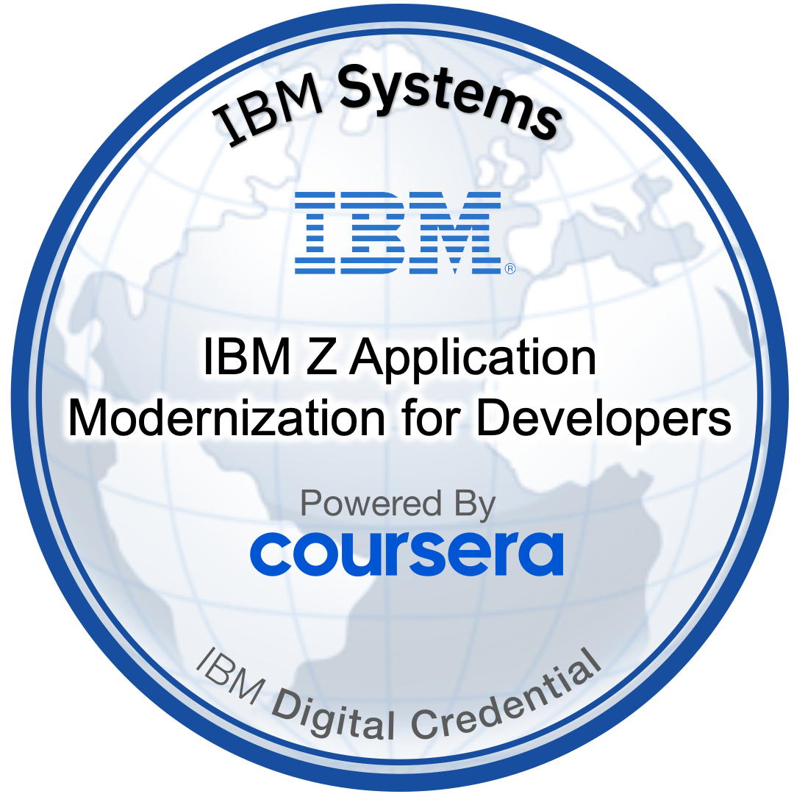

# IBM Z Modernization – Living Interview Notes (JDW)
_Working doc for interview prep, CV bullets, and personal learning notes._

---

## 1. High-Level Narrative: What Is Application Modernization on IBM Z?

- Modernization = evolving, not ripping/replacing, mission-critical systems on IBM Z.
- Core aim:  
  - Unlock existing business logic and data in COBOL/PL/I/CICS/IMS.  
  - Expose safely to web, mobile, APIs, cloud services, and partners.  
  - Keep the resilience, security, and throughput of IBM Z.
- Three key dimensions:  
  - **Infrastructure modernization** – virtualization, cloud/hybrid cloud, Linux on Z, containers.  
  - **Application modernization** – APIs, refactoring, wrappers, microservices integration around Z.  
  - **Process modernization** – DevOps, CI/CD, automated testing, common tooling across Z + distributed.

---

## 2. Why IBM Z Is Still Central (Key Talking Points)

- Many core transactions (payments, card processing, airline bookings, core banking) still run on IBM Z.  
- z Systems are designed for:  
  - Massive secure transaction throughput.  
  - Hardware-accelerated encryption and cryptography.  
  - Extremely high availability and reliability.  
- Modernization **leverages** this strength instead of trying to re-create it elsewhere.

**Soundbite:**  
> We don’t modernize *away* from Z; we modernize *around* it – exposing its strengths to new channels without breaking what already works.

---

## 3. Key Modernization Strategies (Course Notes)

### 3.1 API / Service Enablement

- Wrap core Z functions as APIs/services.  
- Typical technologies: REST, JSON, gateways, z/OS Connect, CICS/IMS service enablement.  
- Benefit: front-end/mobile/cloud teams can consume mainframe capabilities without needing deep Z skills.

**Interview angle:**  
- Show comfort with the idea of service-enabling COBOL/CICS workloads and using APIs as the boundary between legacy and new.

### 3.2 Containers & Hybrid Cloud

- Use containers to package workloads with dependencies and run them consistently:  
  - On Linux on Z, on-prem clusters, or public cloud.  
- Helps create a **portable, cloud-native experience** for developers while still leaning on Z’s reliability where needed.

**Interview angle:**  
- Talk about containers as a way to standardize deployment across environments and bridge Z with cloud.

### 3.3 DevOps & Common Tooling (High-Level)

- Apply DevOps principles to mainframe:  
  - Version control (Git), pipelines, automated testing, continuous delivery.  
- Integrate mainframe changes into the **same CI/CD pipelines** as distributed.  
- Reduce silos: mainframe becomes another platform in the delivery flow, not a separate world.

**Interview angle:**  
- Emphasize interest in bringing DevOps discipline to z/OS work (automated testing, pipelines, infra-as-code where possible).

### 3.4 Security & Pervasive Encryption

- IBM Z provides **pervasive encryption** capabilities:  
  - Encrypt data at rest and in transit across large portions of the estate.  
  - Use crypto hardware to reduce performance impact.  
- Modernization work includes:  
  - Identifying sensitive data.  
  - Designing patterns that preserve or enhance security posture as services are exposed.

**Interview angle:**  
- Highlight Z’s strengths for regulated/financial workloads, and show awareness that modernization must not weaken security.

---

## 4. How This Connects to My Background

- Former IBM MQ / z/OS engineer with experience testing and supporting **mission-critical middleware**.  
- Familiar with:  
  - z/OS environment (JCL, SDSF, RACF, TCP/IP basics, etc.).  
  - Enterprise patterns for high-volume, reliable messaging.  
- Modernization courses (this one + *Architecting Applications for IBM Z and Cloud*) show:  
  - Ability to **bridge classic mainframe skills and modern DevOps / cloud concepts**.  
  - Alignment with roles in mainframe DevOps, system programming, and modernization consulting.

**Draft CV bullet:**  
- Completed IBM “Application Modernization on IBM Z” training, covering API enablement of COBOL/CICS workloads, DevOps and CI/CD practices for z/OS, containerization options, and security patterns such as pervasive encryption, building on 7+ years of hands-on IBM MQ and z/OS experience.

---

## 5. Interview Prep: Sample Questions & My Angles

**Q1 – “What does application modernization on IBM Z mean to you?”**  
- Outline definitions from Section 1.  
- Emphasize evolution, not replacement; hybrid architectures.

**Q2 – “How would you expose a mainframe application to a modern web or mobile app?”**  
- Talk through API/service enablement, z/OS Connect, REST/JSON, gateways.

**Q3 – “Where do containers and cloud fit into mainframe modernization?”**  
- Hybrid cloud, containers for portability, Linux on Z, integration patterns.

**Q4 – “How does DevOps apply to mainframe?”**  
- Common tooling, Git-based workflows, automated testing, CI/CD pipelines including Z changes.

**Q5 – “What are the main security considerations when modernizing Z workloads?”**  
- Pervasive encryption, access control, API security, protecting crown-jewel data as exposure increases.

---

## 6. Personal Reflections (LMB / Mind-Body-Soul)

- **Mind:** Modernization as intellectual bridge between legacy systems and new paradigms.  
- **Body:** Not wasting built muscle (mainframe experience) – instead conditioning and integrating it.  
- **Soul:** Respecting the effort and legacy that built these systems; choosing to steward and extend them instead of discarding them.

**Short mantra:**  
> Preserve what works. Extend what matters. Retire what no longer serves.

---

## 7. Open Questions / To-Do

- Add concrete IBM Z modernization examples (case studies) once covered in later modules.  
- Capture key tools (z/OS Connect, API Gateways, container stacks on Z, CI/CD tools, etc.).  
- Add 1–2 STAR stories from my IBM MQ experience that illustrate modernization themes.  
- Update CV bullets and LinkedIn profile once all IBM Z modernization courses are complete.

---

## 8. DevOps Deep Dive – Tools & Practices on IBM Z

- DevOps = breaking down silos between “Dev” and “Ops” and standardizing/automating the flow from code to production.  
- Goal: reduce manual handoffs, increase visibility, and enable agile, frequent, low-risk change delivery.

### 8.1 Source Code Management (SCM – Git on IBM Z)

- Use a modern SCM (Git) as the single source of truth for application code and related assets.  
- Git replaces traditional library managers that were tightly coupled to specific environments (dev / test / prod).  
- Feature-branch model:  
  - Branches represent features or deliverables, not specific environments.  
  - Enables parallel development and flexible promotion of features into different environments.  
- Git works equally well for:  
  - Assembler, COBOL, PL/I, JCL, and any text-based artifacts (build scripts, automation, config).  
- Rocket Git client and related tooling make it easy to integrate Git-based CI/CD pipelines on z/OS.  
- Having application code, JCL, automation scripts, and config in the same SCM enables true Continuous Integration and Delivery.

### 8.2 Integrated Development Environments (IDEs) for Z

- IDEs are the “digital home” for developers – where they edit, build, run, and debug.  
- Aim is to give Z developers the same rich experience as cloud-native developers:  
  - Syntax highlighting, error hints, unreachable code detection.  
  - Search for definitions/usages, refactoring helpers.  
  - Runtime debugging with breakpoints and variable watches.
- **Microsoft VS Code with IBM Z Open Editor:**  
  - Supports Enterprise COBOL, PL/I, and JCL on z/OS.  
  - Adds real-time syntax checking and code completion for Z languages.  
  - Great for cross-platform devs already using VS Code on non-Z projects.
- **IBM Developer for z/OS (IDz):**  
  - Premier IDE for z/OS with COBOL, PL/I, Java, and C/C++ support.  
  - Provides fully integrated debugging and flexible editing styles (graphical for newer devs, command-style for experienced z/OS pros).

### 8.3 Application Discovery & Delivery Intelligence (ADDI)

- ADDI analyzes IBM Z applications to discover structure and interdependencies.  
- Generates callgraphs that show:  
  - Which COBOL modules call which others.  
  - How programs interact with databases and data files.  
  - How changes in one module may impact others.  
- Helps teams understand legacy estates quickly and make safer, better-scoped changes as part of modernization.

### 8.4 DevOps Outcomes on IBM Z

- Standardized development environments across Z and non-Z.  
- Git-based workflows and CI/CD pipelines that include z/OS changes.  
- Automated build, test, and deployment steps reducing manual error.  
- Mainframe becomes another platform in the continuous delivery flow, rather than a separate, slow-moving silo.

**Interview angle:**  
- Emphasize interest and experience in bringing DevOps discipline to z/OS work:  
  - Git-based SCM instead of legacy library managers.  
  - CI/CD pipelines that treat Z as a first-class target.  
  - Modern IDE workflows (VS Code + Z Open Editor, IDz) to make mainframe development approachable for new teams.  
  - Use tools like ADDI to de-risk change by understanding dependencies before modifying legacy code.

---

## 9. Common Tooling – Making IBM Z “Just Another Platform”

- Common tooling means using the same, industry-standard tools across platforms so skills, scripts, and practices are portable.  
- When Z shares tools with distributed and cloud environments, more people can work on Z without learning a completely separate ecosystem.  
- Using tools that people already list on their CVs / LinkedIn and learn at university (e.g. VS Code, Jenkins, Ansible) makes hiring and onboarding easier and boosts team velocity.

### 9.1 Common Editors & IDEs

- Example: students often use Microsoft VS Code at university to write Python.  
- With IBM Z Open Editor, that same VS Code can be used for COBOL, PL/I, and JCL on z/OS.  
- This lowers the barrier for grads or non-mainframe devs: even if they are new to COBOL, they can start in a familiar editor and focus on learning the language and platform, not brand-new tooling.

### 9.2 Shared DevOps Toolchains & Pipelines

- A common DevOps toolchain lets you define one pipeline that:  
  - Deploys backend components to IBM Z.  
  - Deploys frontend components (web/mobile) to public cloud or distributed environments.  
  - Provides a central dashboard for monitoring and reporting on the whole flow.  
- Example: Jenkins can orchestrate automation so that CI/CD pipelines build, test, and deploy:  
  - Front-end code to public cloud.  
  - Back-end code to z/OS.  
- In this model, Z becomes just another stage in the pipeline rather than a special-case, manual process.

### 9.3 Automation with Ansible on IBM Z

- Ansible is an automation engine used for provisioning, configuration management, application deployment, and other IT tasks.  
- It uses YAML, a simple, human-readable language, for playbooks – widely adopted and easy to learn.  
- You can design automation where some tasks run on Linux and others on z/OS using the same Ansible framework.  
- Ansible Core Collection for z/OS (part of Red Hat Ansible Certified Content for IBM Z) provides reusable modules and roles for common z/OS operations.  
- This supports the idea of IBM Z as a first-class citizen in your wider automation estate, not a separate island.

### 9.4 Key Takeaway

- Working with IBM Z does not have to feel different from working with any other platform.  
- Common, open, widely used tools bridge the gap between mainframe and cloud, enabling shared skills, shared pipelines, and shared automation across the whole enterprise.

**Interview angle:**  
- Emphasize that you understand how **common tooling** reduces silos:  
  - Using VS Code + IBM Z Open Editor so Z dev feels like other dev work.  
  - Using Jenkins so CI/CD pipelines span cloud and Z with one view.  
  - Using Ansible (with z/OS collections) so automation for Linux and Z is written in the same language and framework.  
  - Position IBM Z as “just another platform in the toolchain,” which fits perfectly with modernization and hybrid-cloud narratives.

---

## 10. REST Enablement – z/OS Connect & APIs

- Existing z/OS systems contain invaluable business logic and treasure-troves of data. REST enablement is about **opening those assets up** securely to the rest of the hybrid cloud without moving or rewriting them. fileciteturn3file0  
- REST (Representational State Transfer) APIs are a style of web service that use standard HTTP verbs (GET, POST, PUT, DELETE) and resource-based URLs to expose functionality in a simple, stateless way. fileciteturn3file0  
- IBM z/OS Connect provides a **standard way to expose and consume REST APIs** for z/OS assets and middleware. fileciteturn3file0  

### 10.1 What z/OS Connect Does

- Facilitates calling z/OS target applications via REST calls.  
- Provides a consistent way to identify and reach assets on z/OS (CICS, IMS, Db2, MQ, etc.).  
- Translates incoming REST/JSON (often UTF-8) into the formats and codepages required by the underlying middleware (for example, a JSON payload translated into an EBCDIC JMS message for MQ). fileciteturn3file0  
- Allows you to serve APIs from common z/OS middleware such as IBM CICS, IBM IMS, and IBM Db2.

### 10.2 Example: COBOL in CICS Exposed as REST

- Consider a COBOL application running in CICS:  
  - In z/OS Connect, you define services that convert JSON payloads to COBOL copybooks.  
  - CICS processes the incoming transaction and forwards the payload to the COBOL application in copybook form.  
  - The response payload is then passed back to z/OS Connect and converted into JSON for the caller. fileciteturn3file0  
- z/OS Connect can omit or transform fields before they are returned to the front-end application, removing data that is not relevant to the consumer. fileciteturn3file0  
- This lets front-end and mobile developers interact with long-standing COBOL applications **using familiar REST and JSON**, without needing deep z/OS or COBOL expertise.

### 10.3 Additional Capabilities

- Auditing and transaction logging for API calls.  
- API discoverability and documentation (e.g., using OpenAPI descriptors for integration with API management solutions).  
- Request and response mapping using simple Eclipse-based tooling – largely point-and-click, no mainframe code changes required. fileciteturn3file0  
- Importantly, you can expose assets **without modifying the underlying programs themselves**, reducing risk to core systems while still modernizing access.

### 10.4 Why REST Enablement Matters for Modernization

- Speeds up delivery: new APIs can sometimes be deployed in hours instead of days, because you are orchestrating and mapping rather than rewriting. fileciteturn3file0  
- Aligns mainframe with modern digital channels (web, mobile, partner integrations) via a common, well-understood interface.  
- Protects the investment in existing business logic and data while making it **more accessible and reusable** across the enterprise.

**Interview angle:**  
- Explain how REST + z/OS Connect allows organizations to:  
  - Keep crown-jewel data and logic *on* Z.  
  - Expose that value securely to cloud-native apps via standard REST/JSON.  
  - Avoid risky rewrites by using mapping, transformation, and API management instead of changing COBOL/CICS programs.  
- Position yourself as someone who understands both sides:  
  - The traditional COBOL/CICS world.  
  - The modern REST/JSON/API-first world – and how z/OS Connect bridges them.

---

## 11. Linux & Containers on IBM Z – LinuxONE, OpenShift & zCX

- Many enterprises already rely heavily on **Linux and open source technologies** in their hybrid cloud environments. Running those Linux workloads on IBM Z or LinuxONE brings mainframe-grade qualities of service (security, scalability, reliability) to familiar Linux stacks. fileciteturn4file0  
- Co-locating Linux on Z alongside traditional z/OS workloads reduces latency between tightly coupled systems, often within the same data center or even the same physical frame. This is crucial for performance-sensitive enterprise workloads. fileciteturn4file0  
- Consolidation onto IBM Z / LinuxONE can reduce CPU counts, which is especially valuable where middleware is licensed per-CPU. fileciteturn4file0  

### 11.1 Linux on IBM Z / LinuxONE

- Linux on Z benefits from all the IBM Z platform characteristics you already know: high availability, strong security, and excellent I/O throughput. fileciteturn4file0  
- Co-location benefits include:  
  - Lower network latency between Linux workloads and z/OS systems.  
  - Easier location switch-over during planned or unplanned outages. fileciteturn4file0  
- Enterprises can run **enterprise Linux workloads** side-by-side with their core mainframe workloads, simplifying integration and resilience planning.

### 11.2 Containers & Red Hat OpenShift on Z

- Containers provide a way to package applications and their dependencies for **duplication and portability**, but managing hundreds of containers per system requires orchestration. fileciteturn4file0  
- **Kubernetes** is the de-facto standard orchestrator; **Red Hat OpenShift** is IBM’s premier, enterprise-grade Kubernetes platform. fileciteturn4file0  
- OpenShift manages containerized workloads across a cluster of nodes, handling:  
  - Container scheduling and lifecycle.  
  - Scaling and health management.  
  - Centralized views for developers and operations teams. fileciteturn4file0  
- Since 2020 (OpenShift 4.2), Red Hat OpenShift Container Platform has been available for IBM Z and LinuxONE servers, letting organizations: fileciteturn4file0  
  - Run cloud-native applications on IBM Z hardware.  
  - Leverage Z’s security, scalability, and reliability for container workloads.  
  - Accelerate digital transformation while keeping workloads on an enterprise-grade platform.

### 11.3 z/OS Container Extensions (zCX)

- **IBM z/OS Container Extensions (zCX)**, introduced with z/OS V2R4, allow Linux-based Docker containers to run **within a z/OS environment** under a z/OS management framework. fileciteturn4file0  
- zCX runs the Linux container as its own address space on z/OS, enabling: fileciteturn4file0  
  - Very tight co-location: “Linux on Z” effectively on top of z/OS.  
  - Direct proximity to z/OS applications and data without leaving the system.  
- To the developer, applications look just like any other Docker-based workload; they can use **standard Docker and Linux skills and patterns** without needing to learn z/OS internals. fileciteturn4file0  
- Data centers can operate:  
  - Popular open source packages.  
  - Linux applications.  
  - IBM and third-party software  
  together with z/OS applications and data, leveraging industry-standard skills and tooling. fileciteturn4file0  
- In short, **zCX makes containerization on IBM Z much easier**, aligning mainframe environments with the broader container ecosystem.

### 11.4 Why This Matters for Modernization

- Linux, containers, OpenShift, and zCX extend the IBM Z platform into the **cloud-native world** without abandoning its strengths. fileciteturn4file0  
- Organizations can:  
  - Keep mission-critical data and transaction processing on Z.  
  - Run modern microservices and open source stacks locally, in containers, with low latency access to that data.  
  - Use familiar Kubernetes/OpenShift tooling for deployment and operations across Z and non-Z clusters. fileciteturn4file0  
- This supports a **hybrid cloud narrative** where IBM Z is a central, high-assurance node in an enterprise-wide container and microservices strategy.

**Interview angle:**  
- Position yourself as someone who understands how Linux and containers fit into IBM Z modernization:  
  - Linux on Z / LinuxONE for co-located, enterprise-grade Linux workloads.  
  - OpenShift on Z for orchestrating cloud-native applications using Kubernetes.  
  - zCX for running Docker containers directly under z/OS management, leveraging Linux skills without requiring deep z/OS knowledge.  
- You can talk about using these options to:  
  - Reduce latency and improve resilience through co-location.  
  - Consolidate workloads and reduce licensing costs.  
  - Bring modern DevOps and cloud-native patterns **onto** IBM Z rather than treating it as a separate legacy island.

---

---

## 12. Coursera Module 2 – Deeper Patterns & Tools  
*(COURSEA: Application Modernization for Enterprise Systems – Module 2)*

This section captures additional depth from the Coursera track. It extends earlier notes on **application discovery**, **DevOps culture**, **toolchains**, **Zowe**, and **API-first modernization patterns**.

### 12.1 Application Discovery & Analysis (Coffee Machine Analogy)

- Legacy enterprise applications are often like an **old but beloved coffee machine**: if you press the right buttons in the right order, you get a great result – but almost nobody remembers how it really works inside.  
- Over decades, applications accumulate:  
  - Layers added to solve now-forgotten problems.  
  - Uneven architectures across modules and subsystems.  
  - Lost knowledge as original developers leave.  
- Because of the **size, importance, and history** of these systems, organizations must apply a **high degree of due diligence** before changing or replacing components.  
- Teams need a **single source of truth** about how the application works, how it flows, and how it relates to other systems. This is where **software analysis** and tools like IBM Application Discovery and Delivery Intelligence (ADDI) come in.

**Analysis repository concept**

- The goal of the analysis build is **not** to produce executables, but to assemble and resolve:  
  - Control flows and data flows.  
  - Dependencies between programs, copybooks, DB2 tables, files, etc.  
- Output = an **analysis repository**, built from production versions of source code and related assets.  
- Step 2 is using that repository via tools and UIs to:  
  - Provide metrics.  
  - Browse artifacts.  
  - Perform impact analysis.  
  - Visualize flows and call graphs at different levels of detail.  
- Developers and architects typically interact with this through an **Eclipse-based IDE** (e.g., IDz with ADDI integration), or via **APIs** that feed automation, pipeline gates, and dashboards.

**Business example – replacing an assembler component**

- Example from Coursera: a **car manufacturer** wants to modernize an application that generates identification codes for mechanical parts.  
  - These codes are the starting point for traceability and proof of authenticity.  
  - The generator is written in **Assembler** and cannot be safely maintained by the current team.  
- Using application discovery and analysis:  
  - They build the analysis repository from the existing source.  
  - Use graphical analysis to identify all **entry points** for the ID generation process.  
  - Perform **impact analysis** to discover every system that calls or depends on the component to be decommissioned.  
- Outcome: they can plan adoption of the new component **with confidence**, with a complete, accurate bill of materials for all software components that must change.

**Why this matters**

- Analysis at scale (tens of thousands of programs / tens of thousands of LOC per program) is essential for:  
  - Knowledge-based decisions about architecture changes.  
  - Safely adopting DevOps practices and API exposure.  
  - Onboarding new developers into complex systems much faster.

### 12.2 DevOps Culture & Pipelines (COURSEA View)

- DevOps is framed as a **cultural transformation**:  
  - Increased collaboration, reduced silos.  
  - Continuous learning and improvement.  
  - Transparency, visibility, and trust.  
- In this model, **everything** that contributes to value (source, tests, requirements, designs) is **SCM-managed** for traceability and auditability.  
- The **CI/CD pipeline** is the backbone:  
  - Provides automation, visibility, and feedback loops.  
  - Aims to **fail fast** (find issues early) rather than failing in production.  
- Key concepts:  
  - **Continuous Integration (CI):** developers work in isolation but integrate **small additions frequently**, avoiding “merge hell”.  
  - **Continuous Delivery (CD):** software is always in a state where it *could* be deployed to production at any time.  
  - **Continuous Deployment:** deployments to production are performed frequently and automatically when changes pass the pipeline.  
- For IBM Z, the message is explicit:  
  - z/OS and IBM Z are **not a barrier** to DevOps.  
  - They should be included as **just another platform** in the enterprise DevOps transformation, using **common tooling and a single heterogeneous pipeline**.  
  - No change should reach production **outside** the automated pipeline.

### 12.3 Azure DevOps + IBM Z DevOps Toolchain

- **Azure DevOps** is a SaaS DevOps platform from Microsoft providing Boards, Pipelines, Repos, and Artifacts.  
- Coursera’s referenced demo shows Azure DevOps orchestrating a CI/CD pipeline for a **z/OS COBOL application**, integrating with: fileciteturn6file0  
  - **IBM Developer for z/OS (IDz)** – IDE and developer productivity. fileciteturn6file0  
  - **Dependency Based Build (DBB)** – scripted, repeatable mainframe builds. fileciteturn6file0  
  - **UrbanCode Deploy (UCD)** – deployment automation to z/OS and other environments. fileciteturn6file0  
- Azure Pipelines coordinates the stages; IBM Z DevOps tools do the mainframe-specific build and deploy work.  
- Takeaway: **cloud-hosted DevOps platforms can orchestrate mainframe pipelines** side-by-side with cloud-native workloads, reinforcing the “one pipeline” story from Sections 8 and 9.

### 12.4 Zowe – Open Source Bridge to IBM Z

- **Zowe**, under the Linux Foundation, is an open source framework that provides **modern interfaces to z/OS**, similar to what developers expect on cloud platforms.  
- It combines a set of **server-side** and **client-side** projects:
  - **Zowe Application Framework:** a web UI “desktop” for z/OS with apps like a 3270 terminal, editor, JES / MVS / USS explorers.  
  - **API Mediation Layer:** a reverse proxy and API catalog for z/OS services, plus SSO capabilities.  
  - **Zowe CLI:** a command-line interface for working with data sets, USS, JES, and issuing TSO/console commands – scriptable from shells and CI tools.  
  - **Zowe Explorer (VS Code):** a VS Code extension for browsing and editing data sets, USS files, and jobs; complements Zowe CLI in the IDE.  
  - **ZSS (Zowe System Services):** a z/OS-native HTTPS server enabling REST/WebSocket APIs around z/OS system calls.  
  - **Client SDKs:** Node.js, Java, Python, Kotlin, Swift (in progress) – programmatic access to z/OSMF REST APIs for custom tools and apps.
- Why it matters: Zowe makes z/OS **feel familiar** to developers used to modern CLIs, IDEs, and REST APIs, lowering the barrier to entry and fitting naturally into DevOps and automation toolchains.

### 12.5 API-First Modernization Patterns (Coursera)

- APIs are described as the **“roads and highways” of modernization**: they connect applications, IoT devices, and databases across location, architecture, and language.  
- For cloud-native enhancement of existing code, Coursera emphasizes a **pattern-based approach**:
  - **Application discovery pattern:** use analysis (Section 12.1) to identify the specific function/code segment to be enhanced and its dependencies.  
  - **Expose API pattern:** when refactoring presentation or channel code, expose existing core functionality from CICS/IMS/batch as APIs for the new front end.  
  - **Outbound API / extend pattern:** when the new component is a business rule or shared service, existing core apps call *out* to it via APIs.  
  - **Co-locate applications pattern:** place new cloud-native components as close as possible (network/topology-wise) to related z/OS components to minimize latency.
- Critical considerations:  
  - **Transactional scope & system of record:** if changing code that updates system-of-record data, keep operations within the same transaction scope (e.g., rewrite in Java but still under the same transaction monitor) to avoid breaking consistency.  
  - **Subtle query/format differences:** even small differences in query behavior or data formatting can cause ripple effects; careful testing and impact analysis are key.  
  - **Leverage middleware:** Z middleware (CICS, IMS, MQ, Db2, etc.) often provides integration features that reduce the amount of glue code you need to write.

**Concrete example – exposing Db2 data via z/OS Connect EE**

- Coursera references a demo where an existing **Db2 query** on z/OS is exposed as a RESTful, Swagger-defined API using **z/OS Connect Enterprise Edition (EE)**: fileciteturn6file1  
  - A Db2 administrator first exposes the query as a **Db2 native REST service**. fileciteturn6file1  
  - In the z/OS Connect API Toolkit, a **service project** is created (e.g., `employeeList`) using the Db2 service type. fileciteturn6file1  
  - Request/response schemas are imported from the Db2 service manager, and a connection reference (e.g., `db2Conn`) is specified. fileciteturn6file1  
  - The service is exported as a `.sar` archive and deployed to the z/OS Connect EE runtime. fileciteturn6file1  
  - A new **API project** (e.g., `projectManager`) is created:  
    - A REST resource path `/employees` is defined.  
    - Only the GET method is kept (POST/PUT/DELETE removed).  
    - The previously created Db2 service is mapped into the GET operation. fileciteturn6file1  
  - Response mapping automatically maps the array of employees to the HTTP response body; fields can be omitted if not needed. fileciteturn6file1  
  - After deployment, the API is tested via **Swagger UI**, returning the employee list as JSON objects.
- This example ties together the patterns from this module:  
  - **Application discovery** to locate the right Db2 query and understand its usage.  
  - **Expose API** to make it available to modern tools and UIs.  
  - **Co-location & DevOps** by deploying and managing the API via standard toolchains and testing it through Swagger/OpenAPI tooling.

### 12.6 Module 2 – Quiz Recap (Key Phrases)

Quick phrases to keep in mind from the Coursera Module 2 quiz:

- **DevOps definition:** a *cultural transformation* in the enterprise that increases collaboration, changes work processes, and adopts tools to support these changes – not a move from agile back to waterfall, and not limited to any single platform.
- **Who creates/innovates in DevOps:** everyone involved in delivering value (requirements, code, tests, ops, etc.) participates – not just the development team.
- **IBM Z in DevOps:** IBM Z is most effectively brought into the **standard organizational DevOps transformation as just another set of teams and platforms** to include, rather than a separate silo.
- **CI/CD pipeline:** an integrated, *iterative* pipeline of capabilities that provides the underlying infrastructure for **automation, visibility, and transparency**, enabling fast feedback on code and other artifacts.
- **Enhancing as a Cloud-Native pattern – key steps:**  
  - Identify the function and code segment to be enhanced.  
  - Identify how that code interacts with the rest of the application.  
  - Develop the new enhancements in code and integrate them carefully.  
  - (Changing all API endpoints to run on-premises is *not* a required step; it was the “incorrect” option.)
- **Calculated & measured modernization:** a calculated, measured approach to application modernization minimizes **risk** while leveraging existing investments.
- **System of Record (SOR) changes:** any time we change code that interacts with SOR data, the way we update data must stay in the same **transaction scope** to avoid data-integrity problems.
- **Db2 / z/OS Connect example recap:**  
  - REST path used for employee data: **`/employees`**.  
  - REST method: **GET** to retrieve the list of employees.  
  - Response format: **JSON** array of employee objects.

***

## 13. Coursera Module 3 – Co-Location, Data, Events & CQRS  
*(COURSEA: Application Modernization for Enterprise Systems – Module 3)*

This module focuses on **where** to run new/cloud-native workloads relative to IBM Z, and **how** to expose and protect system-of-record (SOR) data at scale using APIs, events, caching, and CQRS-style read models.

### 13.1 Co-Locating Cloud-Native Workloads on IBM Z

- Core idea: don’t pitch your “tent” far away from the sunrise. Co-locate new applications **as close as possible** to SOR data and core applications on IBM Z to avoid:  
  - Extra network hops and latency.  
  - Throughput bottlenecks.  
  - Additional security exposure.  
  - Increased complexity and cost.
- IBM Z can host both:  
  - Traditional SOR workloads (CICS, IMS, Db2, MQ, batch).  
  - New **cloud-native** workloads (Java, Liberty, containers, microservices) either on z/OS, Linux on Z, or via zCX.

**Example 1 – Fraud detection in the transaction path**

- A credit-card provider runs SOR business logic in **CICS** with COBOL/Java and **Db2** as system of record.  
- They add in-transaction fraud detection logic and keep the influencing logic **on IBM Z**.  
- Result:  
  - Ultra-low latency fraud checks within the payment transaction.  
  - If the fraud detection lived off-platform (public cloud / distributed), every transaction would incur multiple network hops → higher latency and risk of missed fraud.

**Example 2 – Migrating cloud workloads to Z for efficiency**

- Organization runs overnight **batch** jobs, but some business logic was previously moved to **Java microservices on OpenShift** on distributed hardware.  
- The cross-platform calls introduced significant latency and batch windows were at risk.  
- Solution: move those Java workloads back onto IBM Z (Java on Z with leading performance) **without changing the code**.  
- Outcome: order-of-magnitude improvement in latency and batch windows.

**Example 3 – Rehosting a monolithic web app on Z**

- A monolithic web application server on distributed platforms accessed Db2 on z/OS.  
- They rehosted their insurance record processing application on **WebSphere Application Server Liberty** on IBM Z, again **without code changes**.  
- Thanks to Z’s scale-up capabilities, they could **containerize the monolith** without first splitting it into microservices.

**Overall benefits of co-location**

- Lower latency → higher throughput → improved SLA compliance.  
- Reduced total cost of ownership (TCO) by eliminating unnecessary network and infrastructure overhead.  
- Better business continuity, secure end-to-end pipelines, and simpler data-sensitivity handling.  
- Flexible deployment choices on IBM Z:  
  - Natively on **z/OS**.  
  - On **Linux on Z** with a container runtime (e.g., Docker, OpenShift).  
  - Within **z/OS Container Extensions (zCX)**, running Linux containers under z/OS management.

**Interview angle:**  
- Be ready to explain why co-locating workloads on IBM Z:  
  - Minimizes latency and network risk.  
  - Lets you reuse existing Java / Liberty / container skills on Z.  
  - Enables incremental modernization (rehost & containerize first, refactor later).

---

### 13.2 Modern Access to Z Data – Virtualization, Fabric & Caching

- Statistic often quoted: ~80% of the world’s corporate data sits on IBM Z in forms like **IMS, VSAM, Db2 for z/OS**.  
- Naïve pattern: copy data into ODS / data lakes / data hubs via replication pipelines. Problems:  
  - Data latency (yesterday’s snapshot).  
  - Data quality & consistency issues.  
  - High operational complexity and cost.

**Message-in-a-bottle analogy**

- Writing shell counts in a journal on one island and sending a **copied page in a bottle** to another island:  
  - By the time the bottle arrives, the count has changed → stale data.  
- Same issue with scheduled replication: consumers are always slightly out of date.

#### 13.2.1 Access Data In-Place via Modern Interfaces

- Pattern: **enable modern access to existing IBM Z data** directly where it resides.  
- Capabilities:  
  - **Db2 & IMS** exposed via **SQL** and **REST APIs** (using z/OS Connect EE).  
  - Other data sources (IMS, VSAM, etc.) exposed via **SQL/REST** using **Data Virtualization Manager (DVM) for z/OS**.  
- DVM maps traditional structures (IMS segments, VSAM files) to **relational views**, accessible from:  
  - Node.js, Scala, Python, Spark, etc.  
- This preserves existing:  
  - Data management and recovery processes.  
  - SOR ownership and integrity on Z.

#### 13.2.2 Data Fabric – Integrated Virtual Access

- When information is composed/aggregated across **multiple SORs**, use **data virtualization** instead of mass replication:  
  - A “data fabric” lets applications query across many sources via a **single virtual access layer**.  
- **IBM Cloud Pak for Data** integrates with **DVM for z/OS**, providing:  
  - A unified access point for current, accurate data at source.  
  - Governance and metadata management across on-Z and off-Z data.  
- Consuming apps see a **single access point** while data stays in place.

#### 13.2.3 Caching SOR Data

- To meet strict SLAs, repeated reads against the same data should use **caching**:  
  - Offload repetitive queries from SOR databases.  
  - Free main compute resources for new work.
- Key dimensions of cache design:  
  1. **Push vs pull maintenance**  
     - *Push*: cache proactively updated/kept in sync with SOR regardless of access.  
     - *Pull*: cache lazily invalidated/updated based on actual reads.  
  2. **Data structure & representation**  
     - Optimized for consumption: **columnar**, in-memory, or derived/pre-computed aggregates.  
- IBM products implementing these patterns:  
  - **Db2 Analytics Accelerator**.  
  - **Db2 for z/OS Data Gate** (for off-platform analytics/consumption).  
- These provide high-performance reads while still respecting SOR ownership and governance.

#### 13.2.4 Replication, ETL & Change Data Capture (CDC)

- When traffic must be moved from legacy sources to more modern targets (e.g., acquisition, new strategic platforms), use:  
  - Replication & ETL tools to transform data models in a controlled way.  
- Pattern: **replicate SOR data using CDC**:  
  - Near real-time movement of changes into data lakes/hubs.  
  - Supports analytical / ML workloads while keeping SOR authoritative.  
  - IBM replication solutions can be deployed via native or remote agents, including container-based installs.

**Interview angle:**  
- Emphasize a **data-centric integration strategy** that is:  
  - Accessible (SQL/REST, virtualization).  
  - Performant (caching, in-memory/read models).  
  - Accurate and governed (fabric + CDC).  
- Show that you understand when to **access in place**, when to **cache**, and when to **replicate**.

---

### 13.3 Responding to External Events – Event-Driven Architecture on Z

- Example: a push notification from your bank when your account balance is low.  
- Many organizations want to **react in near real-time** to events originating from SOR systems on Z without constantly changing those core applications.

**Event styles**

1. **Near real-time events** – e.g., low balance alerts, fraud detections.  
2. **Post-process events** – e.g., follow-up actions after opening a new account or changing address.

Services built around the core often:  
- Start with fairly tight-coupled patterns (service A calls resource B directly).  
- Evolve into more **loosely coupled, event-based architectures** as needs grow.

#### 13.3.1 Event Sourcing & Streaming Pipeline

Typical flow for Z-originated events:

1. **Event sourcing** – an IBM Z application checks for a condition (e.g., low balance) and raises an event.  
2. The application sends a **message or API call** to an event distribution system (often MQ).  
3. An **MQ–Kafka connector/adapter** publishes that message into a **Kafka topic**.  
4. Kafka (event backbone) distributes the event.  
5. One or more **downstream consumers** subscribe to that topic and act (e.g., send push notifications, trigger workflows).

Concrete example – low balance:

- COBOL logic in **CICS** detects a low balance and passes a message to **MQ** (via CICS-MQ bridge/adapter or via JMS/MQI from Java/JavaScript).  
- MQ forwards the event to **Kafka** via the MQ connector.  
- Cloud-native microservices consume from Kafka and handle notifications / analytics.

#### 13.3.2 Benefits & Deployment Considerations

Benefits:

- Core application stays largely unchanged → **minimized business risk**.  
- New solutions can be added/changed independently by subscribing to events.  
- Existing logic is reused and extended via robust messaging/event infrastructure.

Topology considerations:

- If Kafka runs on-prem or in cloud, place brokers/connectors **close to producers/consumers** to reduce latency.  
- Running MQ/connectors on IBM Z / LinuxONE can improve performance and cost:  
  - Zip-eligible processing (no extra MIPS charges).  
  - Often better throughput/latency compared to purely distributed deployments.

Messaging vs API:

- **API-based (sync)** – API Connect or similar; good when caller expects immediate result and strong delivery semantics.  
- **Messaging-based (async)** – MQ/Kafka; best when:  
  - You need once-and-only-once delivery guarantees.  
  - You want loose coupling and decoupled scaling.  
- Many real-world systems blend both: synchronous APIs to trigger work, events for downstream/async processing.

**Interview angle:**  
- Be able to sketch how a core COBOL/CICS app can emit events into MQ/Kafka, and how that enables new cloud-native services **without rewriting the core**.

---

### 13.4 Optimized CQRS & IBM Z Digital Integration Hub (ZDIH)

- Modern architectures often adopt **CQRS (Command–Query Responsibility Segregation)**:  
  - Separate write-focused SOR systems (commands) from read-optimized views (queries).  
- Goal: keep SORs responsive and protected, even under heavy, multi-line-of-business query loads, by offloading queries to optimized read models.

**ZDIH pattern**

- **IBM Z Digital Integration Hub (ZDIH)** provides an optimized, in-memory aggregation of information that can be surfaced through:  
  - REST APIs.  
  - Event-based interfaces (Kafka, etc.).  
- Core technical components:  
  1. **In-memory, low-latency data grid**  
     - Built on **GridGain for z/OS** (enterprise version of Apache Ignite).  
     - Holds composed/aggregated data optimized for high-throughput queries.  
  2. **Applications to prime and keep caches updated**  
     - Very low-latency intraday updates.  
     - Initial templates provided; customers build further use cases from them.  
  3. **Data-at-rest priming mechanisms**  
     - Use **Data Virtualization Manager for z/OS** (and others) to pull from VSAM, IMS, Db2, PDS/PDSE, etc.

**Benefits**

- Real-time or near real-time information availability that would be impossible against raw data volumes alone.  
- Reusable, governed caches instead of one-off extracts and stale data marts.  
- Highly zip-eligible, lowering cost for read-heavy workloads.  
- Easy access to current information via standard interfaces (REST, events), so:  
  - Hybrid cloud apps and packaged solutions can be built faster.  
  - Business analysts can self-serve more of their information needs.

**Case-study note**

- M&T Bank case study (referenced in the course) shows ZDIH enabling real-time information flow between core banking on Z and hybrid cloud applications:  
  - Demonstrates CQRS in practice with Z as SOR and ZDIH as read-optimized hub.  
  - Illustrates how events, APIs, and caching tie together with DevOps and application discovery.

**Interview angle:**  
- Position CQRS and ZDIH as tools to:  
  - Protect SOR performance while supporting modern, high-volume, multi-channel reads.  
  - Deliver real-time-ish insights without stressing core transactional systems.  
  - Integrate SOR data into hybrid cloud architectures using familiar API/event patterns.

***

## Appendix – Certificates & Proof of Completion

### Application Modernization on IBM Z – IBM Training (Nov 21, 2025)

This course was delivered via IBM Training and underpins the material in Sections 1–11. fileciteturn5file0  

- **Title:** Application Modernization on IBM Z  
- **Provider:** IBM Training  
- **Completion date:** November 21, 2025 fileciteturn5file0  

**Certificate (PDF):**

- [View certificate](./Application Modernization on IBM Z_Course completion certificate.pdf)

<!--
If I ever export a PNG/JPEG version of the certificate, I can embed it visually here, e.g.:

-->

### Application Modernization for Enterprise Systems – Coursera (Nov 21, 2025)

This Coursera course complements the IBM Training material and is focused on **Application Modernization for Enterprise Systems**, including DevOps culture, CI/CD pipelines, Zowe, API patterns, and hybrid-cloud deployment options for IBM Z. fileciteturn8file0  

- **Title:** Application Modernization for Enterprise Systems  
- **Provider:** Coursera (authorized by IBM) fileciteturn8file0  
- **Completion date:** November 21, 2025  
- **Verification:** <https://coursera.org/verify/C6E3GUVEU3CQ> fileciteturn8file0  

**Certificate (PDF):**

- [View Coursera certificate](./Coursera C6E3GUVEU3CQ.pdf)

---

### IBM Z Application Modernization for Developers – IBM Digital Credential (Nov 21, 2025)

Digital badge recognizing successful completion of the **IBM Z Application Modernization for Developers** track, issued via Credly and powered by Coursera. fileciteturn8file1  

- **Title:** IBM Z Application Modernization for Developers  
- **Issuer:** IBM / Coursera (via Credly) fileciteturn8file1  
- **Completion date:** November 21, 2025  
- **Badge verification:** <https://www.credly.com/badges/85d259b2-d329-4387-ba60-f0fe18b1debc> fileciteturn8file1  

**Digital credential files:**

- [View IBM digital credential (PDF)](./IBMDesign20251121-31-6v3k7u.pdf)  
- 