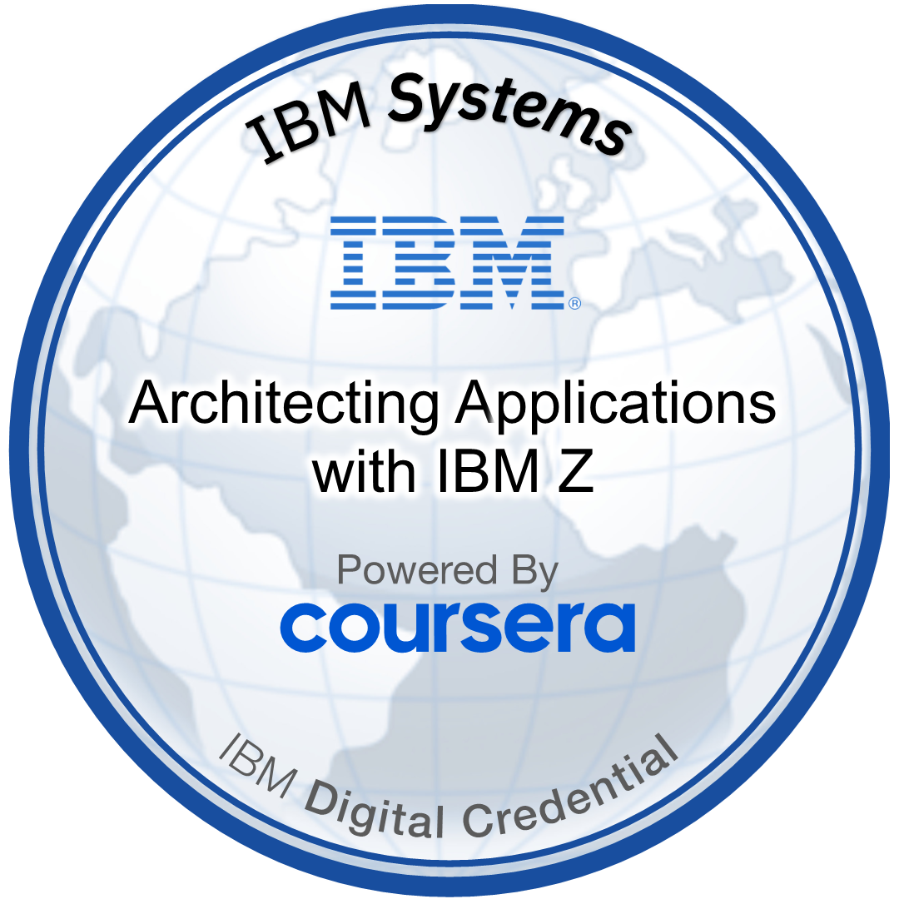
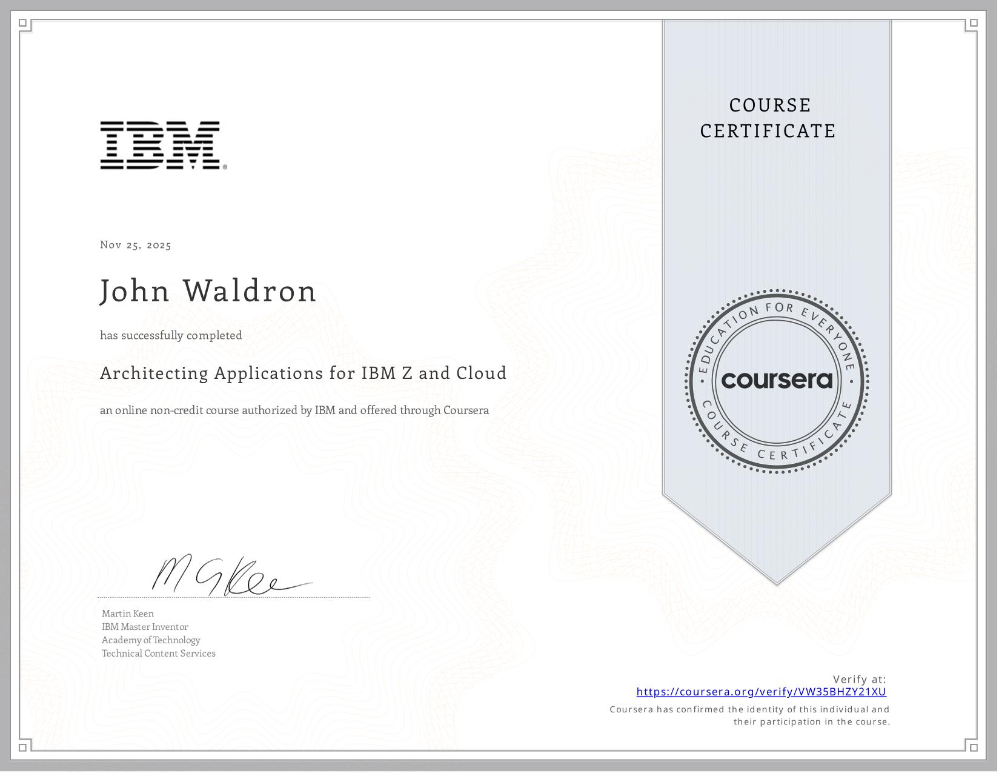

# Architecting Applications for IBM Z and Cloud – JDW Notes

Course: **Architecting Applications for IBM Z and Cloud**  
Mode: Coursera / IBM Z  
Purpose of this file:
- Capture the **architectural patterns** and **modernization strategies** in a way that is interview-ready.
- Distil each module into: *story / analogy → pattern → tools → interview angle*.
- Keep this separate from the first modernization course so this acts as **Badge #2 playbook**.

---

## 1. Course Overview – Architectural Lens

- Takes an **architectural viewpoint** on continuously modernizing core business applications on IBM Z.
- Uses a set of **proven patterns** rather than one-off recipes:
  - Application discovery.
  - API exposure & co-location.
  - Modern access to enterprise data.
  - Enterprise DevOps.
  - Responding to events in near real time.
- Emphasises **agile, incremental modernization**:
  - Minimise business risk.
  - Protect SLAs while evolving systems.
  - Combine IBM Z with cloud / distributed platforms in a hybrid model.
- Framed visually with:
  - **International Space Station** views (macro, systems-level view).
  - **Jeff’s kitchen** (practical, day-to-day reality).

**Interview angle (overview):**
- Position yourself as someone who understands modernization on Z as:
  - A **set of patterns and architectural decisions**, not a single “big bang” rewrite.
  - A continuous journey: discover → expose → co-locate → data/DevOps/events.

---

## 2. Key Mod 2 Themes (from course description)

### 2.1 Application Discovery

> *“Extract consumable information about your software assets and build an inventory of applications and their resource usage and dependencies. Visualize information flow across application components, perform impact analysis, and generate reports to act on your modernization strategy and plan increments with confidence.”*

- Core idea: build a **single, accurate view** of how applications are structured and interconnected.
- Output: **analysis repository + visualizations** that drive safe modernization decisions.

### 2.2 Enterprise DevOps

> *“Provide a cloud-native developer experience for IBM Z by fully integrating IBM Z development into enterprise continuous integration, continuous delivery (CI/CD) pipelines and embracing consistent open-source tools that are familiar to all developers.”*

- Core idea: **IBM Z is just another platform** inside the enterprise DevOps transformation.
- Output: one **heterogeneous CI/CD pipeline** and a **cloud-native dev experience** for Z teams.

---

## 3. Module 2 – Application Discovery

### 3.1 Analogy – Rewiring the Reading Lamp

- Story: trying to move a **reading lamp** onto a wall switch.
  - Looked simple: buy a switch, wire it in.
  - At the **circuit breaker / outlet**, reality was more complex:
    - One outlet in one room affected outlets and appliances elsewhere.
    - Needed to understand the **full circuit** to avoid nasty surprises.
- Analogy:
  - Enterprise apps are like that house wiring:
    - Decades of changes.
    - Invisible connections.
    - Unknown dependency chains.

### 3.2 Why Application Discovery Matters

- Many enterprise applications:
  - Have been developed over **several decades**.
  - Have **uneven architecture** with layers added to fix old problems that people no longer remember.
- Questions like *“can we remove this layer?”* are dangerous without evidence:
  - No-one is fully sure of the impact.
  - “Smart money” says **don’t make assumptions**.
- Given the **size, importance, and history** of these systems:
  - Organisations must apply an **extremely high degree of due diligence** before evolving them.
  - Teams must understand:
    - How each application works internally.
    - How it interacts with *other* applications and resources.

### 3.3 Software Analysis & the Analysis Repository

- **Software analysis** = collecting data from *production* versions of:
  - Source code.
  - Copybooks.
  - DB schemas / data definitions.
  - JCL, configuration, and related assets.
- Goal: create a **single version of the truth** about the application landscape.
- Tooling example: **IBM Application Discovery and Delivery Intelligence (ADDI)**:
  - Provides **up-to-date, consumable information** about application assets and resources.
  - Enables architects and devs to:
    - Visualise application flow.
    - Perform impact analysis.
    - Generate reports for modernization planning.
- Process:
  1. **Gather analysis data** → build the **analysis repository** from real source.
  2. Use the repository to:
     - Provide metrics.
     - Browse artifacts.
     - Perform impact analysis.
     - Display call graphs / data-flow graphs at various zoom levels.
  3. Typical access:
     - Through an **Eclipse-based IDE** (e.g. IDz with ADDI integration).
     - Via **APIs** which:
       - Support automation scenarios.
       - Implement **gates in CI/CD pipelines**.
       - Feed dashboards and reporting.
- Scale considerations:
  - Repositories often handle:
    - **Tens of thousands of programs**.
    - Individual programs with **tens of thousands of lines**.
  - UI workflows and analysis algorithms must be designed for **large-scale** systems.

### 3.4 Example – Car Manufacturer & Assembler Component

- Scenario:
  - Car manufacturer has an application that generates **identification codes for mechanical parts**.
    - These IDs are the start of the **traceability process**.
    - They are the **proof of authenticity** for parts.
  - The ID generation process is written in **Assembler** and can no longer be safely maintained.
  - They want to replace it with a new system that can evolve more gracefully.
- Approach:
  - Build the **application analysis** from existing source into the repository.
  - Use **graphical analysis** to:
    - Identify all **entry points** for the ID generation process.
    - See a high-level but still detailed flow of the process.
  - Perform **impact analysis**:
    - Across all relevant pieces of the IT system.
    - Understand every connection to the component earmarked for decommissioning.
- Outcome:
  - They can plan adoption of the new component **with confidence**.
  - They have a **complete list of software components** that must be modified.
  - Reduces the risk of “surprise outages” when the old Assembler is replaced.

### 3.5 Outcomes & Interview Angle – Application Discovery

**Key outcomes:**
- Application discovery gives:
  - A reliable **inventory** of applications, resources, and dependencies.
  - Visualized **information flow** across components.
  - The ability to do **what-if / impact analysis** before changes.
  - Strong basis for:
    - Adopting DevOps practices.
    - Exposing APIs.
    - Enabling architecture changes.
    - Upgrading to hybrid cloud.

**Interview angle (Application Discovery):**
- Be ready to talk about:
  - Why you never start modernization “blind”; you begin with **analysis and discovery**.
  - Using tools like ADDI to:
    - Build an **analysis repository**.
    - Produce impact reports for stakeholders.
  - How discovery reduces risk when:
    - Replacing legacy components (e.g. Assembler routines).
    - Exposing new APIs on top of existing flows.
    - Planning increments in an **agile** modernization roadmap.

---

## 4. Module 2 – Enterprise DevOps

### 4.1 DevOps as Cultural Transformation

- Enterprises must **evolve constantly** to stay competitive and resist disruption.
- Digital transformation projects aim to leverage:
  - Hybrid cloud.
  - The API economy.
  - Microservices.
  - Containers.
- DevOps is framed as the **cultural engine** behind this:
  - Increased collaboration, decreased silos.
  - Changes in work processes.
  - Adoption of tools that support these changes.
  - Culture of:
    - Continuous learning.
    - Continuous improvement.
    - Transparency, visibility, and trust.
- DevOps works best when it is **inclusive**:
  - Not just dev + ops.
  - Whole enterprise: business, dev, test, ops, security, compliance, etc.

### 4.2 IBM Z Inside Enterprise DevOps

- Most effective organisations:
  - Embrace DevOps **enterprise-wide**.
  - Include **IBM Z applications alongside cloud-native applications**.
- IBM Z is **most effective** when brought into:
  - The **standard organisational DevOps transformation**.
  - As **another set of teams and platforms**, not a special silo.
- Tools and assets exist to:
  - Provide access to IBM Z artifacts within **the same pipeline** as other platforms.
  - Use your **pipeline tools of choice** (Jenkins, GitHub Actions, Azure DevOps, GitLab CI, etc.).

### 4.3 Heterogeneous CI/CD Pipeline Responsibilities

- You can use a **heterogeneous enterprise CI/CD pipeline** to orchestrate:
  - Development.
  - Integration.
  - Deployment of applications across **multiple target platforms**.
- The pipeline must handle **all stages**, including:
  - Build tasks (compile, link-edit, bind).
  - Artifact packaging (JARs, WARs, load modules, deployable artifacts).
  - Deployment to test / pre-prod / prod.
  - Large-scale integration and regression tests.
- Pipeline capabilities:
  - **Gating mechanisms** at each stage (quality gates, approvals).
  - Common compliance, security, and audit controls.

### 4.4 Benefits of One Enterprise Pipeline (Including z/OS)

- Including IBM z/OS in the same pipelines:
  - Supports product teams with a **single way of working**.
  - Simplifies process and **breaks down silos** between mainframe and distributed teams.
  - Brings **common tools**, reducing skill barriers.
  - Allows cloud / distributed developers to work with Z assets using:
    - Modern programming languages.
    - Familiar toolchains and practices.
- Modern Z ecosystem:
  - Supports **modern languages** and practices (e.g. Java, Node.js, open-source tooling).
  - Makes it easier to attract **new talent**.
- Single pipeline gives:
  - **Enterprise-wide visibility** into the software delivery value chain.
  - Ability to deploy each application component to the **best-fit platform**.
  - Focus on shared:
    - Compliance.
    - Security.
    - Audit controls.

### 4.5 DevOps as Process & Culture – Not Tech-Specific

- DevOps is:
  - A **process and culture**, not a specific tool or architecture.
  - Independent of whether an app is:
    - Monolith vs microservices.
    - On-prem vs cloud.
    - Mainframe vs distributed.
- Nothing about existing or new **z/OS applications** blocks them from:
  - Being part of an enterprise DevOps transformation.
  - Benefiting from CI/CD and automation.
- Enterprise DevOps on Z:
  - Provides a **cloud-native developer experience** for IBM Z by:
    - Fully integrating Z development into enterprise CI/CD pipelines.
    - Embracing **consistent open-source tools** that feel familiar to all developers.

### 4.6 Interview Angle – Enterprise DevOps on IBM Z

- Be ready to say:
  - *“In a healthy enterprise DevOps setup, IBM Z is just another first-class platform in the same CI/CD pipeline.”*
- Key points to hit:
  - DevOps = **cultural transformation**, not just Jenkins scripts.
  - Everyone involved in delivering value should be **SCM-managed** and part of the pipeline.
  - Z apps can and should:
    - Use the same Git-based workflows.
    - Build via automated pipelines.
    - Deploy with the same governance as cloud-native services.
  - Benefits:
    - Breaks down “legacy vs modern” silos.
    - Reduces skill/knowledge gaps.
    - Makes Z more approachable for modern devs while preserving its strengths.

---

## 5. Module 3 – Application-Centric Patterns (APIs & Co-Location)

### 5.1 Expose Through APIs – z/OS Connect EE

- APIs (Application Programming Interfaces) expose applications and data hosted on *any* platform via standard, well-defined contracts.
- **OpenAPI specification** describes:
  - Paths/endpoints.
  - HTTP methods.
  - Parameters, payloads, response shapes.
  - Authentication requirements.
- Modernization starting point:
  - Leverage **core business-critical applications on IBM Z** by exposing them as **REST APIs**.
  - New cloud-native logic (mobile, web, analytics, AI) calls into Z via those APIs instead of direct, tightly-coupled links.

**Runtime flow (API → z/OS):**
- A cloud-native application invokes an API managed by an **enterprise API management system** (API gateway).
- The **API gateway**:
  - Authenticates/authorizes the call.
  - Applies policies (rate-limits, logging, security, etc.).
  - Routes approved requests to a corresponding API on **z/OS Connect EE** running on IBM Z.
- **z/OS Connect EE server**:
  - Transforms REST/JSON requests into a payload based on a **COBOL/PL/I copybook format**.
  - Invokes a target z/OS application in **CICS, IMS, or Db2**.
- Response path:
  - z/OS application returns data in its native structure.
  - z/OS Connect EE transforms it back into the **JSON format** defined in the API specification and returns it via the gateway to the caller.

**Benefits:**
- Reuse proven, business-critical logic on Z instead of rewriting.
- Respond faster to market demands by building new UX / channels in cloud-native stacks.
- Mitigate skills pressure on older languages by fronting them with **open-standard APIs** that are easy for modern developers to consume.

---

### 5.2 Application-Centric Patterns: Expose, Extend, Enhance, Refactor

These patterns describe different **ways to evolve Z applications** while keeping them central to the architecture:

**1. Expose (through APIs)**
- Pattern we just described:
  - Core Z application (CICS/IMS/batch/Db2) exposed via **REST APIs** using z/OS Connect EE.
  - New cloud-native apps invoke Z logic through an API gateway.

**2. Extend with Cloud-Native**
- Pattern: **Z as the core**, extended by new functions written as cloud-native services.
- Core IBM z/OS applications (CICS, IMS, batch, Db2) are **augmented** by:
  - New microservices or applications running on cloud/containers.
  - Integration via REST APIs.
- From the **OpenAPI documents**, you can use the **z/OS Connect EE API Toolkit** to:
  - Generate artifacts that allow **COBOL / PL/I** programs to **call outbound APIs**.
  - This lets legacy code directly call cloud services as part of its flow.

**3. Enhance as Cloud-Native**
- Pattern: **incrementally rewrite selected functions** as cloud-native components.
- Instead of a big-bang rewrite:
  - Identify a high-value function.
  - Rebuild it with cloud-native principles:
    - Enterprise DevOps.
    - Open languages.
    - Containers (IBM z/OS, Linux on Z, OpenShift on Z, etc.).
  - Integrate via APIs **to and from** the remaining application.
- Result:
  - Incremental modernization driven by **immediate business needs**.
  - Old and new components coexist while risk is controlled.

**4. Refactor into Discrete Services**
- Pattern: replace hard-to-maintain code with **new, modular services** in a stepwise way.
- Refactored services can:
  - Use the same language (e.g. COBOL → cleaner COBOL).
  - Or migrate to a more suitable language (e.g. COBOL → Java, Node.js) depending on skills/fit.
- Example from the course:
  - Two elements of a Z application refactored into separate services, both hosted on z/OS.
  - One of the new modules is used:
    - Inside the original application, and
    - As a shared service for a new application running on **IBM Cloud**.
- Outcome:
  - Increased reuse.
  - Better separation of concerns.
  - Clearer boundaries for further modernization steps.

**Interview angle (Application-Centric):**
- Be ready to describe the **Expose, Extend, Enhance, Refactor** verbs and when you’d use each:
  - Expose: when you want new channels to reuse Z logic quickly.
  - Extend: when Z stays core, but you add cloud-native features around it.
  - Enhance: when you selectively turn parts of a legacy app into cloud-native components.
  - Refactor: when maintainability is the issue and you want cleaner, service-like boundaries.

---

### 5.3 Co-Locating Applications on IBM Z – “Kitchen Trips” Analogy

- Analogy:
  - In the kitchen, making **dozens of trips** between prep area and stove creates:
    - Risk (dropping things).
    - Latency (getting in people’s way).
  - Better approach: **bring the work closer to where it needs to finish**.
- Architectural parallel:
  - Choices about **where applications and data live** relative to each other are critical for:
    - Performance.
    - Scalability.
    - SLA compliance.
- Data on Z is typically **system-of-record (SOR)** data:
  - Used across multiple lines of business.
  - Consumed by mobile apps, IoT devices, reporting, AI/ML training, etc.
- Requirements:
  - Keep data **available and connected**.
  - Ensure **security, speed, and scalability**.
- Problem if apps are far away:
  - Application calls must traverse **networks and multiple stacks** to reach SOR data.
  - SLAs become vulnerable to “everything that can go wrong” in between.

---

### 5.4 Co-Location Example – WebSphere App + Db2 on Z

- Scenario:
  - Organisation had an IBM WebSphere application on a **distributed environment**, accessing **Db2 on IBM Z** over the network.
  - They wanted to improve performance and meet stricter SLAs.
- Solution:
  - **Containerised** the WebSphere application.
  - Deployed it **on IBM Z**, co-located with the Db2 for z/OS data.
- Results:
  - Achieved roughly **40x increase in queries per minute (QPM)** after co-location.
  - Gains were due to:
    - Data access over **HyperSockets** (direct in-platform link) instead of external network.
    - **Industry-leading Java performance on Z**, providing ~**7–15x reduction in latency**.
- Additional benefits:
  - Lower total cost of ownership (TCO) by consolidating workloads.
  - Simpler end-to-end pipeline for developers.
  - Stronger data security (data stays on Z).
  - Easier handling of dynamic workload surges and scalability.
  - Smoother deployment of packaged solutions on/around Z.

---

### 5.5 Runtime Options for Co-Located Workloads on Z

- IBM Z can host applications in more ways than many people realise:
  - Traditional:
    - **CICS**, **IMS**, **Unix System Services (USS)**.
  - Containers & Linux:
    - **Linux on IBM Z** with container runtimes (Docker, Podman).
    - **IBM z/OS Container Extensions (zCX)** for Linux containers under z/OS.
    - Multiple Linux distros:
      - Red Hat Enterprise Linux (RHEL).
      - SUSE Linux Enterprise Server (SLES).
      - Ubuntu, Debian, Fedora (enterprise support where applicable).
  - Languages & frameworks:
    - Java, JavaScript, Go, Python.
    - Many **AI / ML frameworks**.
- Principle:
  - **“A place for everything, and everything in its place.”**
  - Choose the runtime that balances:
    - Performance (keep latency low, exploit Z hardware).
    - Flexibility (containers, language choice).
    - Security and governance (data locality, compliance).

---

### 5.6 Interview Angle – APIs & Co-Location

- Be able to sketch a simple architecture where:
  - A mobile or cloud-native app calls an **API gateway**.
  - Gateway sends requests to **z/OS Connect EE**.
  - z/OS Connect transforms JSON → copybook, calls CICS/IMS/Db2, and returns JSON.
- Talk through the **Expose / Extend / Enhance / Refactor** patterns as a vocabulary for:
  - Reusing existing COBOL/PL/I logic.
  - Adding new cloud-native features around Z.
  - Incrementally rewriting the most valuable pieces.
  - Refactoring legacy modules into cleaner services.
- Explain **co-location** in business terms:
  - Move compute closer to SOR data on Z to:
    - Reduce latency.
    - Improve throughput (e.g. “we’ve seen orders-of-magnitude QPS improvements”).
    - Strengthen security and simplify compliance.
  - Highlight that IBM Z offers:
    - Multiple runtimes and container options.
    - A natural home for workloads that need **both** performance and trust.

## 6. Module 4 – Data-Centric Integration (Modern Access to Z Data)

### 6.1 Big Picture – Modern Access to IBM Z Data

- Architecting solutions is an **ongoing skill**:
  - New languages, frameworks, and platforms appear constantly.
  - We must keep revisiting **how data is accessed** because it drives:
    - Speed and responsiveness.
    - Scalability.
    - Cost and efficiency.
    - Security and data quality.
- On IBM Z, data access patterns need to:
  - Support **modern application integration** (cloud, mobile, analytics, AI).
  - Preserve **existing data management and recovery processes** on Z.
  - Maintain **data consistency and integrity**.
- Key pattern family: **Enable modern access to IBM Z data**:
  - High‑level SQL‑based query.
  - REST API data access.
  - Designed to support rapid integration while safeguarding:
    - Data integrity & quality.
    - Performance.
    - Operational procedures (backup, recovery, etc.).

---

### 6.2 Pattern 1 – Enable Modern Access to IBM Z Data

- Focus: **accessing Z data directly where it lives**, using:
  - **SQL‑based queries**.
  - **REST APIs**.
- Goals:
  - Allow new apps (cloud‑native, mobile, analytics, AI) to access **real‑time Z data**.
  - Avoid crude bulk exports that break:
    - Integrity.
    - Recovery processes.
    - Governance and compliance.
- Benefits:
  - Rapid application integration via standard interfaces.
  - Better control of data quality (no stale CSVs flying around).
  - Maintains existing **Z data management / backup / recovery** flows.
  - Higher performance than generic ETL pipelines, especially when co-located.

**Interview angle:**
- Emphasise that modern Z data access is **SQL + REST first**, not ad‑hoc file dumps.
- Highlight that you’d prefer **in‑place access** for SOR data, then layer patterns like:
  - Caching.
  - Virtualisation.
  - Replication.
  - Transformation.

---

### 6.3 Pattern 2 – Virtualized IBM Z Data (Single Relational View)

- Problem:
  - Enterprises have **multiple data sources** on Z:
    - VSAM.
    - IMS.
    - Adabas.
    - Db2 for z/OS.
  - Applications often need to query **across** these sources at once.
- Solution pattern: **Virtualized IBM Z data**:
  - Provide a **single relational view** across disparate sources.
  - Expose that view via **SQL** and **REST APIs**.
  - Avoid physical data movement or copies.
- Tooling example: **IBM Data Virtualization Manager (DVM) for z/OS**:
  - Maps traditional Z data structures to **relational views**.
  - Lets modern apps access them through standard interfaces.
- Benefits:
  - Single logical view of data without creating more copies.
  - Simplifies access and reduces **complexity & error risk**.
  - Ideal when **data sources are many** but access must be simplified/streamlined.

**Interview angle:**
- Be able to say:  
  *“If we have VSAM/IMS/Db2 all in play, I’d look at data virtualisation (DVM) to present a relational view via SQL/REST rather than copy data out into yet another silo.”*

---

### 6.4 Pattern 3 – Cache IBM Z Data (Optimised Copies)

- Problem:
  - Directly hitting SOR databases for every read:
    - Adds load to core systems.
    - Can threaten SLAs under **spiky / unpredictable traffic**.
  - Traditional ETL / bulk copies are:
    - Batch‑oriented.
    - Not built for low‑latency, high‑volume access.
- Solution pattern: **Cache IBM Z data**:
  - Create **optimised copies** of Z data in dedicated caching layers.
  - Offload **read‑heavy logic** from the core system to high‑speed caches.
- Properties of good Z caching:
  - Resilient under:
    - Massive sharp spikes in activity.
    - High, unpredictable volumes.
  - Deals with **data currency** intelligently:
    - Where to accept near‑real‑time vs strict real‑time.
- Product examples mentioned:
  - **IBM Db2 Analytics Accelerator (IDAA)**.
  - **IBM Z Digital Integration Hub (ZDIH)**.
  - **IBM Db2 for z/OS Data Gateway**.
  - **IBM Z Table Accelerator**.
  - **IBM Data Virtualizer for z/OS with Cache Option**.
- Benefits:
  - Frees compute resources on the core SOR systems.
  - Provides high‑throughput, low‑latency access for read‑heavy workloads.
  - Fits naturally with **event‑driven and API‑driven** architectures.

**Interview angle:**
- Describe when you’d push for a **caching pattern**:
  - “High‑volume reads against SOR data where we can safely serve slightly de‑coupled copies.”
  - Mention that IBM provides multiple cache‑friendly products to implement this cleanly.

---

### 6.5 Pattern 4 – Replicate IBM Z Data (Near‑Zero RPO/RTO)

- When a solution calls for a **remote copy of SOR data**, use **replication**:
  - Supports **near real‑time** data availability in another location.
  - Enables **continuous availability** for mission‑critical workloads.
- Concepts:
  - **RPO (Recovery Point Objective)** near zero:
    - Almost no data loss in failover scenarios.
  - **RTO (Recovery Time Objective)** near zero:
    - Failover and recovery are effectively seamless for workloads.
- Topologies:
  - Environments can be heterogeneous in general.
  - For **continuous availability**, often **homogeneous**:
    - Db2 → Db2, IMS → IMS, VSAM → VSAM.
- Enhancements:
  - **IBM Z GDPS Continuous Availability** can augment replication with:
    - Centralised control plane.
    - Intelligent routing.
    - Automation and monitoring.
- Reference pattern: **Replicate IBM Z data**.

**Interview angle:**
- Talk about replication as part of your **HA/DR strategy**:
  - When you need a **second live copy** of SOR data at distance.
  - How RPO/RTO constraints drive the choice of replication tooling and topology.

---

### 6.6 Pattern 5 – Transform IBM Z Data (New Systems of Record)

- Use case:
  - You need to **incrementally build new, modernised systems of record**.
  - You want to **derive new data stores** from existing SOR data.
- Pattern: **Transform IBM Z data**:
  - Software processes transform SOR data into **new data sets**.
  - Example: building a new analytical or operational data store from a mix of:
    - Db2.
    - IMS.
    - VSAM.
    - Sequential files.
- Capabilities:
  - Federated queries and/or aggregate copies spanning multiple Z stacks.
  - Add derived fields (summations, aggregations, transformations).
  - Optionally extend with:
    - Distributed databases.
    - External feeds (market data, IoT, etc.).
- Benefits:
  - Increases the **value of the original SOR data** without disrupting workloads.
  - Allows modern apps to work with curated/aggregated views while Z continues as the core SOR.
- Reference pattern: **Transform IBM Z data**.

**Interview angle:**
- Be ready to differentiate between:
  - **Virtualise** (no new store; logical view) vs **Transform** (new physical store with derived data).
  - When you’d introduce a **new system of record or data mart** versus keeping everything virtual.

---

### 6.7 Summary – Data-Centric Integration on Z

- Modern IBM Z data strategies are **pattern‑driven**:
  - **Enable modern access** – SQL/REST directly to Z data, preserving management & recovery.
  - **Virtualise** – single relational view across VSAM/IMS/Db2/etc. without moving data.
  - **Cache** – optimised copies to handle extreme read volume and latency constraints.
  - **Replicate** – second live copy for near‑zero RPO/RTO and continuous availability.
  - **Transform** – build new, derived data stores for analytics and new SOR needs.
- As an architect / engineer you want to:
  - Choose the **least disruptive** pattern first (access/virtualise).
  - Add caching/replication only when there is a **clear SLA, HA, or performance driver**.
  - Use transformation when there is a long‑term case for a **new data store**.
- In conversation, frame yourself as someone who can:
  - Start from **business needs and SLAs**.
  - Select the right **data‑centric pattern** on IBM Z.
  - Balance **consistency, performance, and risk** instead of defaulting to crude ETL.

## 7. Module 5 – Event-Driven Integration (Events & CQRS)

### 7.1 Event-Based Loose Coupling – Big Picture

- **Event-based loose coupling**:
  - An application **raises an event**.
  - An **event stream infrastructure** (backbone) delivers that event to **interested consumers**.
  - Consumers decide how to react, without tight coupling to the producer.
- Why it matters for Z:
  - Lets core IBM Z applications **trigger new behaviours** without changing their core logic.
  - Lets **external events** drive Z logic in a scalable, low-risk way.
- This module focuses on two patterns:
  1. **Respond to IBM Z application events** (Z is the *source* of events).
  2. **Respond to external events** (Z is the *responder* to events raised elsewhere).
- Plus: an **optimized CQRS** pattern using **IBM Z Digital Integration Hub (ZDIH)** for high-volume read/query side.

---

### 7.2 Pattern – Respond to IBM Z Application Events

> *“Share events that are generated in IBM Z applications so that new application logic can be developed to respond to such events without introducing risks in core applications.”*

- Scenario:
  - Core application on IBM Z raises a business event:
    - E.g. **banking app** detecting a **low account balance** and triggering an alert.
- Flow:
  1. **Core Z application**:
     - Runs on IBM Z (CICS/IMS/batch etc.).
     - Analyzes data as part of its normal logic and detects a condition (event).
  2. It interfaces with an **event distribution system** via:
     - A **message** (e.g. MQ), or
     - An **outbound API**.
  3. A **Kafka connector/adapter** transforms the message/API call and **publishes an event** into the backbone.
  4. An **event backbone** (often Apache Kafka):
     - Can run on, off, or across IBM Z.
     - Distributes the event to interested consumers.
  5. **Downstream applications**:
     - Are designed to **consume and respond** to these events.
     - Can run **on IBM Z or off-platform** (cloud, distributed).
     - Implement new response logic **without modifying the core Z app**.

- Key idea:
  - Z core assets become **triggers** in an event-driven architecture.
  - New logic is added **around** the core, not **inside** it → lower risk.

**Interview angle:**
- “If a Z core app needs to drive new behaviour (e.g. low balance alerts), I’d have it emit events into Kafka via MQ/connector, and keep all new logic in downstream consumers, keeping the core stable.”

---

### 7.3 Pattern – Respond to External Events

> *“Share events that are generated by applications that are external to IBM Z to drive the invocation of IBM Z application logic.”*

- Here, the **event source is external**:
  - A distributed or cloud app emits an event.
  - IBM Z applications participate as **responders**.
- Two integration styles:

**1. Tightly coupled (no events):**
- External app calls **z/OS Connect EE** directly via REST.
- z/OS Connect EE then invokes **CICS/IMS/Db2** programs.
- Synchronous request–response, simple but tightly coupled.

**2. Loosely coupled (event-based):**
- External app (web, mobile, SaaS, cloud) raises an **event** into an event backbone (e.g. Kafka).
- One or more **new Z or non-Z applications** consume that event:
  - Interpret the high-level business request.
  - As part of their response, call **Z core applications** via APIs enabled by **z/OS Connect EE**.
- Benefits:
  - New logic is **flexible**, can evolve independently.
  - Core Z applications are accessed via **stable APIs**, preserving integrity.

**Interview angle:**
- “If external systems need to trigger Z logic and the use case suits eventual consistency, I’d favour a Kafka-based event backbone plus z/OS Connect EE for calling into CICS/IMS, rather than tight, point-to-point RPC everywhere.”

---

### 7.4 Flight Example – Cheap Fare Alerts

- Existing system:
  - Flight data stored in **Db2 on Z**.
  - A **CICS** application handles **flight pricing logic** (COBOL).
- New requirement:
  - Passengers can **opt in to be notified** if a cheaper flight becomes available within a certain **date/time range and price limit**.
  - No strict real-time guarantee needed → great candidate for **loosely coupled** event-based logic.

**Event-based sequence:**
1. **User** selects date/time range + price limit in the booking front-end:
   - Web app, mobile app, or even airport kiosk.
2. The **front-end** sends this subscription as an **event** to the backend via the **event backbone**:
   - Typically **Apache Kafka**.
3. New **flight scheduling & business logic**:
   - Written in a modern language such as **Java or Go**.
   - Runs alongside (but separate from) existing COBOL/CICS logic.
   - Consumes events from Kafka.
4. A **Kafka connector** receives the events and passes them to this new business logic component.
5. When a potential cheaper flight is found, the new logic:
   - Calls into the existing **COBOL pricing logic** via **z/OS Connect EE**.
   - z/OS Connect EE invokes the CICS program and returns results.
6. Both the **Kafka connector** and **z/OS Connect EE** are **zIIP (ZIP) eligible**:
   - This makes the integration **cost-efficient** on IBM Z.

**Key takeaway:**
- New “cheap fare alert” functionality was added **without changing the core reservation system**.
- Event + API combo gives:
  - Flexibility.
  - Safety for core Z logic.
  - Ability to react quickly to new market demands.

---

### 7.5 Optimized CQRS with Z Digital Integration Hub (ZDIH)

> *Real-time event/API-driven architectures are powerful, but pushing all raw SOR data/events through them at scale can kill performance and SLAs. Optimized CQRS is the pattern to fix that on Z.*

- Context:
  - Enterprises are building **event backbones** and API layers across the organisation.
  - High-volume systems of record (SOR) on Z face:
    - **Performance and latency** challenges if every query/event hits them directly.
    - Risk of **overloading SOR** with unpredictable read/query activity.
- Requirements:
  - Make information available in near real-time.
  - **Scale** and decouple services from SOR.
  - **Protect SOR** from heavy queries.
  - Integrate with enterprise **event-based architectures**.

**CQRS concept (here):**
- **C**ommand/**Q**uery **R**esponsibility **S**egregation:
  - Separate **command side** (SOR updates) from **query side** (read models for consumers).
- Optimized CQRS pattern on Z:
  - Don’t stream/mirror **all raw data**.
  - Create an **optimized aggregation** of relevant information.
  - Surface that aggregated information via:
    - Standard APIs (REST).
    - Event streams (Kafka, etc.).

**IBM Z Digital Integration Hub (ZDIH) – Implementation on Z:**
ZDIH materialises this pattern with three key components:

1. **In-memory, high-performance cache layer:**
   - Low-latency, high-throughput **in-memory database**.
   - Caches **composed and aggregated** information (not raw tables).
   - Uses **GridGain for z/OS** (enterprise version of Apache Ignite).

2. **Applications that prime and maintain caches:**
   - Apps that **load and keep intraday caches up to date** at very low latency.
   - Initial implementations can be reused as **templates** for additional use cases.

3. **Data-at-rest priming from Z sources:**
   - Mechanisms to prime caches from existing Z data sources using:
     - **IBM Data Virtualization Manager (DVM) for z/OS** to access:
       - VSAM, IMS, Db2 for z/OS, PDS/PDS(E), etc.
   - Allows building query models that align with consumer needs without hammering SOR.

**Benefits:**
- Information flows **quickly and efficiently**, based on current data.
- Fewer **one-off custom extracts** → reusable caches of consumable information.
- **ZDIH is highly zIIP-eligible**:
  - Offloads work to specialty engines → lowers cost of read-heavy workloads.
- Better **governance and security**:
  - Raw data is aggregated/curated before being exposed.
- Having **in-memory, standards-based access** to current information:
  - Lets teams quickly build downstream hybrid cloud apps.
  - Makes integration with packaged ISV solutions easier.
  - Supports **self-service analytics** (no more stale one-off extracts).

**Conceptual summary:**
- Command side:
  - SOR data updated by online/batch apps on Z.
- Query side:
  - ZDIH caches, aligned with what new applications actually need.
- Optimized CQRS on Z **synchronises** these two worlds efficiently and safely.

---

### 7.6 Interview Angle – Events & CQRS on IBM Z

Be ready to articulate:

- **Two “respond” patterns:**
  - **Respond to Z application events**:
    - Core Z app raises an event → Kafka → downstream consumers on/off Z.
    - No core changes; new logic sits in consumers.
  - **Respond to external events**:
    - External system emits events → Kafka → Z-side consumers.
    - Z logic is accessed via APIs (z/OS Connect) in a loosely coupled way.

- **Tight vs loose coupling:**
  - Tight: external app calls z/OS Connect EE directly for synchronous flows.
  - Loose: external or Z apps raise events; dedicated consumers handle them with more flexibility and better decoupling.

- **Example narrative:**
  - Cheap flight notification:
    - Kafka backbone, new Java/Go logic, COBOL pricing via z/OS Connect, zIIP eligibility → new feature, zero changes to core.

- **Optimized CQRS / ZDIH:**
  - You understand that:
    - Not all data should be streamed raw.
    - ZDIH provides an **in-memory aggregated query model**.
    - GridGain for z/OS + DVM + event/API interfaces form the core.
  - You’d use optimized CQRS when:
    - There’s **high-volume query demand**.
    - Services must be decoupled from SOR.
    - You still want real or near real-time responses.

## 8. Module 6 – Course Wrap-Up & Next Steps

- The course closes by zooming back out to the **architectural big picture**:
  - You’ve seen how **patterns + tooling** come together across:
    - Application discovery.
    - API exposure & co-location.
    - Modern data access / data-centric integration.
    - Enterprise DevOps.
    - Event-driven integration & optimized CQRS (ZDIH).
  - The emphasis is on **continuous, incremental modernization** rather than one-off projects.

- Key closing messages:
  - You now have a **pattern language** for architecting applications on IBM Z and cloud:
    - Expose / Extend / Enhance / Refactor (application-centric).
    - Access / Virtualise / Cache / Replicate / Transform (data-centric).
    - Respond to Z events / Respond to external events / Optimized CQRS (event-centric).
  - Modernization on Z is about:
    - **Reducing risk** while evolving core systems.
    - **Protecting SLAs** and data integrity.
    - Taking advantage of IBM Z’s strengths (performance, security, resiliency) inside a **hybrid cloud** architecture.

- The instructors point you to:
  - Further IBM resources on **ibm.com** for:
    - Pattern deep dives.
    - Hands-on labs.
    - Product documentation (z/OS Connect EE, DVM, ZDIH, MQ, Kafka integration, CI/CD tooling, etc.).
  - The idea is that the course is a **starting point**, not the end of the journey.

### 8.1 Interview Angle – How to Summarise This Badge

Key points to remember about this badge:

- Focus is on architecting hybrid solutions where IBM Z remains the trusted system of record while surrounding it with modern capabilities.
- Emphasises discovery and analysis before change (application discovery, impact analysis, repository-based understanding).
- Uses APIs and co-location to reuse Z logic and reduce latency instead of rewriting everything.
- Treats data strategy as pattern-driven: access in place, virtualise, cache, replicate, and transform based on SLAs and risk.
- Brings IBM Z into a single enterprise DevOps pipeline so mainframe and cloud teams share tooling and process.
- Uses event-driven integration and optimised CQRS (ZDIH) to add new features and high-volume queries without overloading core systems.

Summary line: incremental, pattern-based modernization that keeps IBM Z central while integrating cleanly with cloud-native services, modern data access, DevOps, and event-driven architectures.

---

## 9. Course Credential & Badge

**Course:** Architecting Applications for IBM Z and Cloud (Coursera)  
**Learner:** John Waldron  
**Completion date:** 25 Nov 2025  

- **Coursera course certificate**  
  - Title: *Architecting Applications for IBM Z and Cloud*  
  - Verify: https://coursera.org/verify/VW35BHZY21XU  
  - Local assets (adjust paths to match your repo layout):
    - `./Cert-Badges-Modernization/Architecting_Applications_with_IBM_Z/VW35BHZY21XU.pdf`
    - `./Cert-Badges-Modernization/Architecting_Applications_with_IBM_Z/VW35BHZY21XU.jpeg`

- **IBM Digital Badge – Architecting Applications with IBM Z**  [oai_citation:0‡IBMDesign20251125-32-6nmx4f.pdf](sediment://file_000000003170720e822386c32fc39339)  
  - Issuer: IBM / Coursera (via Credly)  
  - Verify: https://www.credly.com/badges/e63a8ef7-7913-4765-9eb3-c00bb385b848  
  - Public URL: https://www.credly.com/badges/e63a8ef7-7913-4765-9eb3-c00bb385b848/public_url  
  - Local assets:
    - `./Cert-Badges-Modernization/Architecting_Applications_with_IBM_Z/architecting-applications-with-ibm-z.1.png`
    - `./Cert-Badges-Modernization/Architecting_Applications_with_IBM_Z/IBMDesign20251125-32-6nmx4f.pdf`

### 9.1 Embedded images (optional)

---