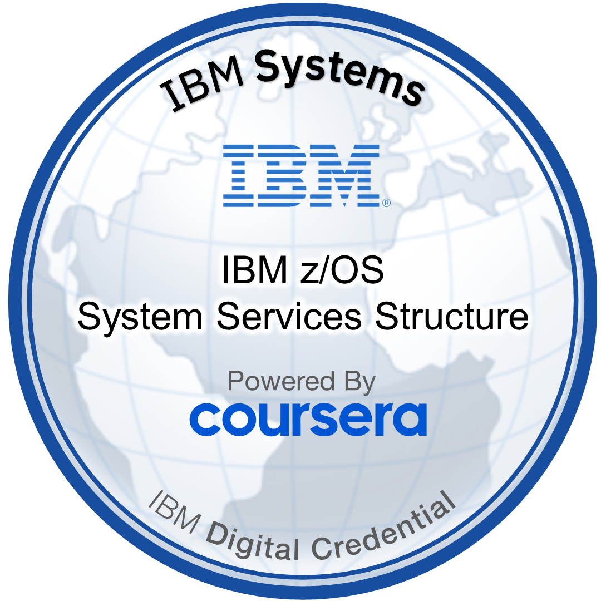

# z/OS System Services Structure – JDW Notes

Course: **z/OS System Services Structure**  
Mode: Coursera / IBM Z  
Instructor: Jeff B.  
Purpose of this file:

- Build the **core mental model** of how z/OS, z/Architecture, and z16 hardware fit together.
- Capture **system-programmer-level concepts** (registers, control blocks, interrupts, address spaces, I/O flow).
- Distil each unit into: *concepts → examples → control blocks / structures → “how this helps me debug/architect”*.

---

## 1. Unit 1 – Orientation & Learning Objectives

### 1.1 What this course is for

- General tour of **z/OS system services and facilities**:
  - Enough depth to reason about problems and know **which components to inspect**.
  - Acts as a **base layer** before deeper courses (WLM, storage, JES, I/O, etc.).
- Assumes you are at least loosely familiar with:
  - **Multiprocessing** concepts and **basic address-space architecture**.
  - **Interrupts, SVCs, dispatcher, serialization**.
  - Storage types: *real/central, expanded, auxiliary, virtual*.
  - Hex notation + a bit of **assembler / z/Architecture instruction execution**.
- Target outcome:
  - Think like a **system programmer**, not just an app dev running jobs on top.

### 1.2 Official learning objectives (JDW version)

By the end of the course you should be able to:

- **Registers & execution**
  - Identify the **general-purpose registers (GPRs)** and their roles.
  - Describe how key hardware components participate during instruction execution  
    (CPU, PSW, control registers, storage hierarchy, channel subsystem, etc.).
- **Interrupts**
  - Explain the **hardware/software interaction** when an interrupt occurs.
  - Know the **four places status can be saved** for an interrupted unit of work  
    (will map to specific PSW / control-block save areas later).
- **Control blocks**
  - Describe the **general purpose of z/OS control blocks**:
    - Capture current state.
    - Chain related structures.
    - Drive dispatcher, I/O, storage management, etc.
- **Address spaces & servers**
  - Explain how hardware and z/OS components interact with **address spaces**.
  - Differentiate **system address spaces vs. user address spaces** and how they cooperate.
  - Identify the major **“servers” in a z/OS environment** (e.g. JES, XCF, catalog, TCP/IP stack) and how they support workloads.

Use these as a **checklist** at the end of the course: you should be able to teach each bullet to someone else.

---

## 2. z/Architecture – High-Level Overview

> z/Architecture = the formal spec that defines how IBM Z hardware behaves and how operating systems interact with it.

### 2.1 Relationship between architecture, hardware, and OS

- **z/Architecture**
  - Defines:
    - Instruction set (what opcodes mean, how they behave).
    - Register sets and PSW format.
    - How I/O instructions work.
    - How exceptions/interrupts are signalled and handled.
    - How multiple programs are scheduled and supervised.
- **z/System processors (z16, z15, …)**
  - Physical **implementation** of that architecture:
    - Telum-based CPUs, cache hierarchy, memory, channels, crypto, etc.
- **Operating systems (z/OS, z/VM, Linux on Z, …)**
  - Written to **use that instruction set** and exploit the hardware features.
  - z/OS, in particular, assumes z/Architecture and its interrupt / PSW model.

Handy mental equation:

> *Architecture* (rules) → *Machine* (z16 box) → *OS* (z/OS using those rules).

### 2.2 Evolution & backward compatibility

- z/Architecture is an **evolution** of earlier families:
  - System/360 → System/370 → 370-XA / ESA/390 → z/Architecture.
- Key milestones:
  - **Virtual storage** introduced with System/370.
  - **31-bit addressing** (ESA) → 2 GB addressable range.
  - **64-bit addressing** (z/Architecture) → current generation.
- Compatibility goal:
  - **24-bit, 31-bit, and 64-bit applications** can still run (in the right environment) on modern z/Systems.
  - There are still programs from the **OS/360 era (1960s)** running today, unmodified.
- This evolutionary approach is why:
  - The platform can support **modern workloads** (cloud, mobile, analytics, AI).
  - While still honouring **decades of existing code**.

### 2.3 Why this matters for a system programmer

When you’re debugging / tuning:

- You are always reasoning about **how z/OS maps work to the architecture**:
  - Which **PSW** is current?
  - Which **GPRs/CRs** are holding key state?
  - Which **control block chain** describes the running task or I/O?
- Understanding that the architecture is **stable and backward compatible** explains:
  - Why so much tooling and documentation still references **MVS, OS/390, ESA**, etc.
  - Why you will see mixtures of **24-, 31-, and 64-bit** addressing modes in dumps.

---

## 3. Reading Assignment – IBM z16 Technical Introduction

Reference PDF: `IBM z16 Technical Introduction.pdf` (IBM Redbooks, SG24-8950).

Use it like a **hardware companion** to this course:

- After finishing the Unit 1 videos, skim:
  - **Chapter 1 – IBM z16 overview**  
    - How z16 fits into digital transformation, hybrid cloud, and modernization.
    - Table 1-1 for **headline capabilities** (cores, memory, I/O limits, etc.).
  - **Chapter 2 – Hardware overview**  
    - Models, frames, CPC drawers, I/O system structure.
  - **Chapter 4 – System design strengths**  
    - Capacity and performance, virtualization, RAS, Parallel Sysplex, crypto, quantum-safe features.
- As you read, tie back to Unit 1 concepts:
  - “Where do **GPRs/PSW** live in this machine model?”
  - “How does the **I/O system structure** map to what we’ll later see as UCBs, subchannels, paths?”
  - “Which parts of the hardware are relevant when an **interrupt** occurs?”

Suggested use in future sections of this `.md`:

- When a later module introduces a concept (e.g. **channel subsystem**, **LPARs**, **interrupt classes**), add a short note like:
  - “See z16 Redbook: Ch 2.4 I/O system structure → maps to subchannels / paths we’re drawing here.”

---

Nice, this is a chunky one but it actually hangs together really cleanly once you see the flow. I’ll turn it into a compact cheat-sheet you can revise from.

⸻

Module 2 – Operating Environment Initialization (Cheat Sheet)

1. Big Picture: What IPL Actually Does

At a high level an IPL (Initial Program Load) does four big things:
	1.	Loads the nucleus (core z/OS supervisor code) from disk into real storage.
	2.	Initializes hardware + storage and creates the key system address spaces.
	3.	Reads configuration from SYS1.PARMLIB and related datasets (LNKLST, LPA, etc.).
	4.	Starts JES + subsystems, so the system can run work.

Phases:
	•	POR / LPAR activation (pre-IPL)
	•	Power-on reset sets up LPARs, storage boundaries, channels, etc.
	•	LPAR activation assigns CPUs and memory to each LPAR.
	•	Hardware IPL phase
	•	Operator chooses LOAD ADDRESS (SYSRES DASD device).
	•	Hardware reads bootstrap record and IPLTEXT at a fixed location on that volume:
	•	IPLTEXT = program IEAIPL00 (the IPL control program).
	•	This is just enough code to start loading the OS.
	•	Software IPL phase
	•	IEAIPL00 loads the IRIMs (IPL Resource Initialization Manager) from SYS1.NUCLEUS.
	•	IRIM:
	•	Builds the common area.
	•	Locates master catalog and other critical datasets.
	•	Reads SYS1.PARMLIB and other logical PARMLIBs.
	•	Creates the first address space (Master – ASID 001) and other system spaces.
	•	NIP (Nucleus Initialization Program) runs:
	•	Establishes the nucleus in real storage (non-pageable).
	•	Invokes RIMs (Resource Initialization Modules) to bring up subsystems/devices.
	•	Handles early operator prompts.

Once that’s done, z/OS is “up” and you move into normal system runtime.

⸻

2. Critical Datasets for IPL

These are the “must-knows” that always impress in interviews:

2.1 SYS1.NUCLEUS
	•	Where: SYSRES volume.
	•	Contains:
	•	IRIMs (IPL Resource Initialization Manager).
	•	NIP (Nucleus Initialization Program).
	•	RIMs (Resource Initialization Modules).
	•	Basic supervisor modules of the kernel.
	•	Specified in: PARMLIB LOADxx (NUC= or via last char of LOADxx field).
	•	Default member: IEANUC01 (you can choose another to test a new nucleus build, e.g. after applying PTFs).

2.2 SYS1.LPALIB
	•	Required dataset.
	•	Holds modules loaded into LPA (Link Pack Area), specifically the pageable LPA (PLPA/POPA):
	•	System routines.
	•	SVC routines.
	•	Access methods (data management).
	•	Non-resident machine check handler.
	•	Program binder/link-editors.
	•	Auth/accounting exits, logon mode tables, some TSO/E modules, etc.
	•	Cannot be a PDSE (must be PDS) because PDSE support isn’t available during early IPL.

2.3 SYS1.LINKLIB
	•	By default a required PDS or PDSE dataset.
	•	First library in the LNKLST (linked list of system and user load libraries).
	•	Contains MASTER JCL module, which:
	•	Provides the initial JCL to start JES2/JES3 and other key subsystems.
	•	This is where z/OS gets its “first jobs” from.

2.4 SYS1.SVCLIB
	•	Load library with recovery routines used if errors occur during IPL.
	•	Resides on SYSRES.
	•	Set up by MVS initialization; usually you never touch it as an operator.

2.5 Paging, SMF, LOGREC, Dumps
	•	Page datasets
	•	Used by storage manager for paging and swapping.
	•	Required so the system doesn’t run out of real storage.
	•	SYS1.PROCLIB
	•	Holds system procedures (e.g. DFSMSHSM starter jobs, JES procs).
	•	When you START something on the console, you’re often kicking off a PROC from here.
	•	SMF datasets (SYS1.MANx)
	•	Optional but in practice always there.
	•	Collect job and system utilization data.
	•	You usually see multiple (MAN1, MAN2, MAN3…).
	•	LOGREC dataset (SYS1.LOGREC or similar)
	•	Records machine, processor, device, channel errors plus missing interrupt info and DDR activity.
	•	Technically optional but strongly recommended.
	•	SYS1.DAE
	•	Stores info about Dump Analysis and Elimination (DAE) for unique dumps.
	•	SYS1.DUMPxx datasets
	•	Sequential datasets containing system dumps after abends or system failures.

Note: Some of these must be PDS (not PDSE) because PDSE support only exists after a certain IPL point. So anything needed early in IPL stays PDS.

⸻

3. I/O Configuration (HCD + IODF) and PARMLIB

3.1 IODF (I/O Definition File)
	•	Built by HCD (Hardware Configuration Definition).
	•	Contains:
	•	CPC & LPAR info.
	•	Channel paths, control units, devices.
	•	EDTs etc.
	•	IOCDS / IODF used both:
	•	At POR/LPAR activation (hardware view).
	•	By z/OS at IPL to create UCBs (Unit Control Blocks) in SQA for each device.

3.2 SYS1.PARMLIB
	•	Required dataset.
	•	Think of it as z/OS’s equivalent of /etc on Unix.
	•	Holds hundreds of PARMLIB members that define:
	•	System options, security options, performance tuning.
	•	Device and storage options.
	•	JES, WLM, TCP/IP and many other subsystems’ parameters.
	•	z/OS reads:
	•	SYS1.PARMLIB + any logical PARMLIBs you have chained in.
	•	Combines parameters with operator replies during IPL.
	•	Best practice:
	•	Keep PARMLIB on SYSRES or another always-available system volume.
	•	Monitor changes carefully; this library controls almost everything.

⸻

4. LOADxx and IPL Parameters

4.1 LOADxx Member
	•	Lives in SYS1.PARMLIB.
	•	One of the most important members; IPL will fail without a valid LOADxx.
	•	You can have many (e.g. LOAD00, LOAD01, LOADA1) but only one suffix xx is used per IPL.

LOAD parameter at the HMC / console looks like:
	•	ddddxxSn (conceptually):
	•	dddd – device address containing the IODF (or SYSRES depending on system).
	•	xx – LOADxx suffix (e.g. 00 → LOAD00).
	•	S – message suppression flag:
	•	Show all IPL messages.
	•	Suppress some/none.
	•	Don’t suppress everything; you want those messages.
	•	n – last character of nucleus name IEANUC0n:
	•	If you put 6, system uses IEANUC06.

LOADxx also specifies:
	•	Which IODF to use.
	•	Which SYS1.NUCLEUS member to use.
	•	Which master catalog (CATALOG statement).
	•	Which IEASYSxx (SYS1.PARMLIB system options) to use, via SYSPARM and IEASYSxx linkage.

4.2 Master Catalog and Alternate
	•	Master catalog:
	•	Points to system datasets, page datasets, and other user catalogs.
	•	Alternate master catalog:
	•	Backup.
	•	Useful in multi-system / sysplex environments.
	•	During IPL, NIP can prompt the operator:
	•	“Use master or alternate catalog?”
	•	You can hit ENTER to take what LOADxx specifies, or specify a different suffix.

4.3 IEASYSxx (System Options)
	•	IEASYS00 is the default.
	•	To customize:
	•	Create IEASYS01, etc.
	•	IEASYS00 is always read first; subsequent members override defaults.
	•	Best practice:
	•	Keep IEASYS00 IPL-safe and conservative.
	•	Put custom tuning and experimental changes in other suffixes (e.g. IEASYS01, IEASYS02).
	•	If a new combination breaks IPL, you can fall back to IEASYS00 via LOADxx or SYSPARM choices.

⸻

5. NIP, PSA, and Early Console Behaviour
	•	During NIP:
	•	System may prompt for additional parameters.
	•	Historically, NIP messages would “time-out” and roll between multiple consoles — easy to miss, leading to disabled wait codes (e.g. 007).
	•	Modern behaviour:
	•	If z/OS can’t find a console, it stays on the HMC; no more console-hopping 007 fiasco.
	•	Boot strap area and low storage are eventually overwritten by PSA (Prefix Save Area):
	•	PSA has a key role in interrupt handling.
	•	Nucleus remains in real storage and is non-pageable.

⸻

6. Link Pack Area (LPA) and Address Spaces

6.1 LPA Overview
All modules in:
	•	SYS1.LPALIB and any system library concatenated to it are placed into the LPA.

LPA is divided into:
	1.	Fixed LPA (FLPA)
	2.	Modified LPA (MLPA)
	3.	Pageable LPA (PLPA / POPA)

IPL actions:
	•	Cold start IPL:
	•	Builds POPA/extended POPA fresh, resets tables to match what’s in LPALIB.
	•	Quick / warm start IPL:
	•	Reuses existing tables; POPA/extended POPA already established.

Modules loaded into:
	•	FLPA / EFLPA: non-pageable system code you want resident.
	•	MLPA / EMLPA: overrides or additions for a specific IPL.
	•	POPA / EPLPA: pageable common code.

⸻

6.2 Master Scheduler and System Address Spaces
	•	Master Scheduler address space:
	•	First address space created.
	•	ASID 001 (not 000).
	•	Creates:
	•	Other system address spaces.
	•	Eventually the JES address space (JES2/JES3).
	•	Owns the master trace table (buffers used to trace console messages).
	•	Initializes system services like logging, communication tasks, etc.

Some important system address spaces mentioned:
	•	PC AUTH – manages cross-address-space calls (PC routines).
	•	RASP – address space for Real Storage Manager (RSM).
	•	TRACE – buffers + routines for system trace.
	•	DUMPSRV – dump services address space.
	•	XCFAS – cross-system coupling facility address space (sysplex stuff).
	•	GRS – Global Resource Serialization (ENQs across systems).
	•	SMXC – PDS/PDSE locking support.
	•	SYSBM – System Buffer Management subsystem.
	•	APPC – APPC/TPF related work.
	•	Schedulers for APPC, HSM, ANSM, catalogs, etc.

Most of these are:
	•	Created automatically during IPL.
	•	Some need a START command from the console or automation.

⸻

7. SYS1.PROCLIB and First Programs
	•	SYS1.PROCLIB holds system procedures (PROCs).
	•	For example:
	•	DFSMSHSM startup procedures.
	•	JES2/JES3 PROCs.
	•	When an address space is started:
	•	The PROC in PROCLIB defines the first program to run in that address space after initialization.
	•	Ties back to:
	•	MASTER JCL in SYS1.LINKLIB → starts JES.
	•	JES then uses PROCLIB to start further system and application workloads.

⸻

8. Init & Tuning Guide – How This Fits

The z/OS MVS Initialization and Tuning Reference (“Init & Tuning”) is basically:
	•	The deep manual for:
	•	SYS1.PARMLIB members (syntax, options, defaults).
	•	The exact system initialization sequence.
	•	Part 1: Overview:
	•	Mirrors what you just studied in this module:
	•	System tailoring concepts.
	•	High-level IPL and config flow.
	•	As you get more comfortable you’ll use it like:
	•	“What does this IEASYSxx keyword do?”
	•	“What are all valid options for xxxPARM?”

You don’t read it cover-to-cover; you dip into it when you’re tuning or troubleshooting.

⸻

9. Quick Revision Q&A (for yourself)

You can test yourself with these in your head later:
	•	Q: What’s on SYS1.NUCLEUS and how do we choose which nucleus to IPL with?
A: IRIMs, NIP, RIMs and core supervisor modules. Chosen via LOADxx (NUC= or last LOAD field char → IEANUC0n).
	•	Q: What’s the role of SYS1.LPALIB vs SYS1.LINKLIB?
A: LPALIB → modules in LPA (common, often pageable system code). LINKLIB → first in LNKLST, contains MASTER JCL and other system programs.
	•	Q: What does LOADxx control?
A: Which IODF/SYSRES, which nucleus, which master catalog, which IEASYSxx, and some message suppression options.
	•	Q: What’s the first address space and its ASID?
A: Master Scheduler, ASID 001.
	•	Q: Why must some datasets be PDS not PDSE for IPL?
A: Because PDSE services aren’t available until later in IPL; early-IPL datasets must use plain PDS.

⸻

# module 3 task management

Nice, this is a juicy unit – lots of stuff you already feel from CST days, now wired into proper z/OS terms. Here’s a compact cheat-sheet you can drop under # module 3 task management in your notes.

⸻

3. Task Management – JDW Notes / Cheat Sheet

3.1 Big Picture – From Job to Task
	•	You submit work via:
	•	JCL (batch job),
	•	START command (started task),
	•	TSO LOGON / commands (TSO user).
	•	JES handles the front and back end:
	•	Spools JCL + SYSIN.
	•	Assigns a JOB number and places the job on the job queue.
	•	Schedules the job when an initiator of the right class is free.
	•	During execution:
	•	Reads SYSIN from spool.
	•	Writes SYSOUT to spool.
	•	On termination:
	•	Routes SYSOUT to printers/other devices based on output class and device characteristics.
	•	Purges job from spool + job queue.

For z/OS itself, each job step = a unit of work → becomes a task. Multi-step jobs = multiple tasks, each step’s task runs after the previous completes.

⸻

3.2 Dispatcher, WUQ, TCBs and SRBs
	•	Goal of the dispatcher: decide which unit of work runs next on a CPU.
	•	Work is queued on the Work Unit Queue (WUQ):
	•	Contains TCBs (Task Control Blocks) and SRBs (Service Request Blocks).
	•	Dispatcher picks highest-priority ready work.
	•	When an address space is selected:
	•	z/OS must tell the CPU:
	•	Which address space?
	•	Which task (TCB/SRB)?
	•	To (re)dispatch a task, the dispatcher:
	1.	Restores task status:
	•	General registers, floating-point registers, access registers.
	•	These were saved in control blocks when the task last lost control.
	2.	Loads control registers (CR1, CR7, CR13, etc.) with address-space specific tables:
	•	Segment / region tables for this address space.
	•	Done via a single hardware instruction: LASP – Load Address Space Control.
	3.	Ends with an instruction to load the PSW:
	•	Once PSW is loaded, CPU executes the next instruction pointed to by that PSW.
	•	That is “the task” resuming.

Mental loop: WUQ → Dispatcher chooses TCB/SRB → load CRs + registers → load PSW → task runs → interrupt / wait → dispatcher again.

⸻

3.3 TCB vs SRB and Non-preemptable Work
	•	TCB (Task Control Block):
	•	Main “normal” dispatchable work unit.
	•	Associated with a specific address space.
	•	Full context saved/restored by dispatcher.
	•	SRB (Service Request Block):
	•	Special dispatchable work type, usually short duration.
	•	Can run at very high priority, often above “normal” address spaces.
	•	Can execute concurrently with its owning address space on another CPU.
	•	Non-preemptable unit of work:
	•	Special environment (usually SRB-mode) where:
	•	After an interrupt, control must return to this unit of work.
	•	System does not go back to the dispatcher to pick something else.
	•	Runs to completion; minimal control block overhead because no repeated save/restore cycles are needed.

⸻

3.4 Enclaves and Business Transactions
	•	Enclave = logical grouping of work that represents a business transaction, ignoring address-space boundaries.
	•	Can pull together:
	•	Multiple programs,
	•	Multiple address spaces,
	•	Both TCB and SRB work.
	•	Why enclaves matter:
	•	Traditional rules = “priority based on address space”.
	•	With enclaves:
	•	Different work in the same address space can have different priorities.
	•	Work from different address spaces can be grouped at the same priority.
	•	Enclaves are pre-emptible:
	•	z/OS dispatcher + WLM can interrupt an enclave to run more important work.
	•	Types:
	•	Independent enclave
	•	True SRM/WLM transaction.
	•	Classified and managed in its own service class / performance group.
	•	Dependent enclave
	•	Logical extension of an existing address-space transaction.
	•	Inherits service class / performance group from the owning address space.
	•	Key point:
	•	Enclave transactions can span multiple dispatchable units across one or more address spaces, but are still reported and managed as a unit.

⸻

3.5 CPU Topology, PR/SM and Hyperdispatch
	•	IBM Z hardware is modular:
	•	Drawers / books:
	•	Horizontally arranged CPU + memory = drawer (like a chest drawer).
	•	Vertically arranged = book (like books on a shelf).
	•	Each drawer/book:
	•	Contains processors,
	•	Memory,
	•	I/O fan-out,
	•	Cache layout (varies by machine).
	•	PR/SM (PR/SM hypervisor):
	•	Sits between hardware and LPARs.
	•	Manages resource types:
	•	General-purpose CPUs, IFLs, ICFs, SAPs, etc.
	•	LPARs only see logical processors, not the physical layout.
	•	CPU management views:
	•	Horizontal view:
	•	z/OS knows everything about the workload.
	•	PR/SM knows everything about the processors.
	•	Pre-hyperdispatch:
	•	z/OS demands CPU; PR/SM simply supplies CPU cycles from whatever is available.
	•	Hyperdispatch:
	•	z/OS and PR/SM cooperate:
	•	z/OS considers processor topology when dispatching.
	•	PR/SM firmware (Miller code) tries to keep logical CPUs “affined” to particular physical cores / books.
	•	Goal: keep work close to its data:
	•	Minimize latency and cache misses, especially on high-frequency processors.
	•	Practically:
	•	You rarely control the high-level CPU layout.
	•	But for performance tuning, knowing hyperdispatch, SMT, and WLM is key.

⸻

3.6 WLM and SMT – Using CPUs for Business Goals
	•	WLM (Workload Manager):
	•	Ensures resources first go to work that supports business goals.
	•	Works with:
	•	Service classes, report classes, and goals (e.g. response time, velocity).
	•	Continuously:
	•	Monitors performance vs goals.
	•	Adjusts priorities and resource access to keep critical business workloads on track.
	•	SMT (Simultaneous Multithreading):
	•	Allows multiple instruction streams per core.
	•	Even with the same CPU frequency, SMT can:
	•	Do useful work while other threads are waiting on cache / memory.
	•	Increase throughput without a clock bump.

Reading task: Workload Manager Redbook, chapters 1–10 – map examples in the book to:
	•	Enclaves (transactions),
	•	Service classes (business priorities),
	•	The reality of “report vs real-time transaction”.

⸻

3.7 Address Spaces Revisited
	•	Remember the main blocks:
	•	ASCB (Address Space Control Block): core descriptor for the address space.
	•	ASXB (Address Space Extension Block):
	•	Logical extension of ASCB.
	•	Swappable, resides in LSQA (Local System Queue Area).
	•	ASCB itself is not swappable.
	•	In every address space, three core z/OS tasks:
	•	RCT – Region Control Task:
	•	Prepares the address space for first swap-out.
	•	Prepares it for work after swap-in.
	•	Dump task:
	•	Handles scheduled SVC dumps.
	•	STC task (Started Task Control):
	•	Prepares the address space for the work it was created to do.

3.7.1 Batch Address Spaces
	•	Created when an initiator is started during JES initialization.
	•	For each job scheduled into that address space (by priority & class):
	•	Initiator attaches the program in PGM= → creates job step TCB.
	•	That job step task may attach subtasks (more TCBs) that compete for CPU.
	•	If multiple tasks in the same address space are ready:
	•	That address space can run on more than one processor simultaneously.
	•	Address space terminates when the STARTed initiator is stopped and no jobs remain.

3.7.2 TSO User Address Spaces
	•	Created when z/OS receives a TSO LOGON.
	•	Terminated at LOGOFF.
	•	TMP (Terminal Monitor Program):
	•	Accepts and interprets TSO commands.
	•	Issues the familiar READY prompt.
	•	For each command:
	•	Attaches a task (TCB) for that command.
	•	When it completes, TMP returns control to the terminal and waits.

3.7.3 Started Task Address Spaces
	•	Created when:
	•	A START command is issued from the console, or
	•	Via COMMANDxx member in PARMLIB during IPL.
	•	STC:
	•	Attaches the program named on the EXEC statement of the PROC.
	•	Address space ends when the started task program terminates.
	•	MOUNT command or ASCRE macro can also create address spaces with a TCB structure.

⸻

3.8 Dispatcher Queue Internals and No-work TCB
	•	Dispatcher queue = queue of all ready work in the system:
	•	Aka System Work Unit Queue (WUQ).
	•	WEB (Work Element Block):
	•	Associates ready work on the WUQ with the address space where it runs.
	•	SVT (Supervisor Vector Table):
	•	Contains pointers to key supervisor routines, control blocks, and queues.
	•	Dispatcher logic:
	•	Picks the highest-priority ready TCB in the highest-priority address space.
	•	If no ready work:
	•	Loads an enabled WAIT PSW from the no-work TCB (dummy TCB).
	•	CPU sits in a controlled wait until there’s something to run.

⸻

3.9 Dynamic Linkage – LINK, LOAD, ATTACH, XCTL
	•	Programs can invoke many subprograms; dynamic linkage uses supervisor routines:
	•	LINK – call another program and return.
	•	LOAD – locate + load a program into storage (without immediately passing control).
	•	ATTACH – create a new task (TCB) to run a program concurrently/subtasked.
	•	XCTL – transfer control to another program without returning.
	•	These names match assembler macros: LINK, LOAD, ATTACH, XCTL.

3.9.1 Program Search Order
When z/OS “finds” a program, finding includes:
	•	Locating, and if necessary,
	•	Loading into virtual storage,
	•	Building control blocks describing the program.

Search order (simplified):
	1.	Your address space (already loaded modules, private libraries).
	2.	Job/step libraries:
	•	JOBLIB, STEPLIB.
	3.	System area:
	•	Already-resident code: LPA/EFLPA/MLPA/ELPA.
	•	Then system libraries in LINKLST.

Good mental note: private first (your stuff), then shared system areas (LPA), then global system libraries (LINKLST).

⸻

3.10 AMODE and RMODE – Addressing vs Residence
	•	z/Architecture today: 64-bit addressing.
	•	Backwards compatibility:
	•	24-bit addressing (oldest).
	•	31-bit addressing (ESA).
	•	Terminology:
	•	“The line” = 16 MB limit (24-bit addressing ceiling).
	•	“The bar” = 2 GB limit (31-bit addressing ceiling).

AMODE (Addressing Mode)
	•	Tells hardware how many bits of an address are used when a program runs.
	•	Values:
	•	24 – 24-bit,
	•	31 – 31-bit,
	•	ANY – 24 or 31,
	•	64 – 64-bit only,
	•	MIN – binder chooses the most restrictive mode across all CSECTs.

RMODE (Residence Mode)
	•	Tells z/OS where a program module may be loaded in virtual storage.
	•	Must be addressable by the program’s AMODE.
	•	Values:
	•	24 – must reside below 16 MB (“below the line”).
	•	ANY – can reside anywhere below or above the 16 MB line.
	•	SPLIT – part below the line, part above.
	•	64 – treated as ANY for loading/execution, with nuances for certain data classes like CWSA64 above the 2 GB bar.

PSW Bits
	•	In ESA mode, PSW bit 12 = 1; in z/Architecture mode it’s always 0.
	•	PSW bits 31 and 32 determine the addressing mode (24 / 31 / 64).

⸻

3.11 Serialization and GRS
	•	Serialization = controlling access to shared resources so one doesn’t corrupt another’s data.
	•	Core tools:
	•	ENQ / DEQ:
	•	Standard interface for most code, including user programs.
	•	Also used by system components.
	•	RESERVE:
	•	Used at device level (e.g. to reserve a volume).
	•	Locks:
	•	For internal z/OS control blocks.
	•	Latch manager:
	•	Callable from high-level languages, another mechanism to serialize access.

Global Resource Serialization (GRS)
	•	z/OS component that handles global resource serialization across systems in a sysplex.
	•	Required in a sysplex, even if other products help with serialization.
	•	Works by:
	•	Using ENQ/DEQ/RESERVE macros.
	•	Checking RNL (Resource Name List):
	•	Defines resources and their scope.
	•	Names can be fully specified or pattern-based.
	•	Every time a job runs:
	•	ENQ/DEQ happens under the hood, driven by DD statements, etc.
	•	This prevents different systems from trampling on each other’s datasets/resources.

Think: instead of every application reinventing locking, z/OS offers system-wide serialization (GRS) as a primitive.

⸻

3.12 Quick Revision Q&A

You can test yourself later with:
	•	Q: What’s the difference between a TCB and an SRB?
	•	A: TCB = general task, full context, tied to address space. SRB = special, short, often higher priority unit of work, can execute concurrently and at different priority, often with minimal state.
	•	Q: What is an enclave?
	•	A: A logical grouping of work (TCBs + SRBs, multiple address spaces) representing a business transaction; can be independent or dependent; managed/reporting as a single unit by WLM.
	•	Q: How does PR/SM + hyperdispatch help performance?
	•	A: PR/SM abstracts physical CPUs into logical processors; hyperdispatch lets z/OS align logical CPUs to physical cores/books, improving cache locality and reducing latency.
	•	Q: Name the three key tasks in every address space.
	•	A: Region Control Task (RCT), Dump Task, Started Task Control (STC).
	•	Q: What do ENQ/DEQ and GRS achieve?
	•	A: System-wide serialization of resources so multiple jobs/systems can safely share datasets and control blocks, especially in a sysplex.
	•	Q: AMODE vs RMODE in one sentence?
	•	A: AMODE = how many bits are used when addressing memory; RMODE = where the module is allowed to reside in virtual storage.

⸻

# module 4

Nice, this is a fun one – all the “outside my bubble” stuff finally wired together.
Here’s a Module 4 cheat-sheet you can paste under # module 4 in your notes.

⸻

4. Addressability & Cross-Memory – JDW Notes / Cheat Sheet

4.1 Big Picture – From One Space to Many
	•	Every dispatchable unit of work (TCB or SRB) belongs to an address space.
	•	When the dispatcher selects a TCB/SRB, it:
	•	Loads the segment table origin for that address space into CR1.
	•	Loads other control registers as needed (CR7, CR13, etc.).
	•	In the simple case (no cross-memory):
	•	Instructions + data are fetched from one address space.
	•	Virtual → real translation uses the tables pointed to by CR1.
	•	That address space is:
	•	The home address space (where the work unit was first dispatched).
	•	Also the primary address space (where instructions are executing).
	•	Also the secondary address space (for data moves).

As long as all three match, life is simple: the task is living entirely inside its own bubble.

⸻

4.2 Home, Primary, and Secondary Address Spaces

When we start using cross-memory services:
	•	Home address space
	•	Where the TCB/SRB was originally dispatched.
	•	“Owner” of the work unit.
	•	Primary address space
	•	The address space from which instructions are currently being fetched.
	•	Changes when you execute a Program Call (PC) into another address space.
	•	Secondary address space
	•	An additional address space whose data you can move to/from.
	•	Used by certain instructions (e.g. MVCP/MVCS) when in cross-memory mode.

Key idea:

After a PC, the primary may change to the service provider’s address space,
while the home stays with the caller and the secondary can be either.

When home ≠ primary ≠ secondary, you are in cross-memory mode.

⸻

4.3 Virtual Storage Space & Common Area
	•	Every user gets their own address space (TSO, batch, STC, system spaces, etc.).
	•	Each address space is a sequence of virtual addresses; in z/Architecture:
	•	Up to 16 exabytes of virtual storage per address space (64-bit).
	•	Code must still be loaded below 2 GB (“below the bar”), but can execute and reach data above it.

Structure:
	•	Common area
	•	A reserved region in each address space.
	•	Holds system code + control info (e.g., storage manager structures, nucleus, CSA, etc.).
	•	Is addressable from all address spaces → shared system brain.
	•	Private area
	•	Uniquely associated with a given address space.
	•	Used for that address space’s own programs and data.
	•	Architecturally protected from references by other address spaces.

Historical extensions:
	•	Data spaces
	•	Data-only address spaces (no executable code).
	•	Used to extend storage for big data structures.
	•	Still used in some subsystems (e.g. LLA / VLF).
	•	Hyper spaces
	•	Special spaces for data that’s moved via specific instructions.
	•	Much less common now that we have 16 EB of addressable space.

System vs user address spaces:
	•	System address spaces: created at z/OS startup (e.g. MASTER, JES, XCFAS, GRS, etc.).
	•	User/initiator/TSO/STC spaces: created when:
	•	A user logs on (TSO),
	•	A START command is issued,
	•	JES creates initiators to run batch jobs.

Modern sharing:
	•	Previously you had to copy data into common storage to share it.
	•	Now, SRBs + cross-memory + access registers allow controlled sharing without copying everything into common.

⸻

4.4 Program Calls (PC/PR) & the Linkage Stack

Scenario (classic LLA/VLF example):
	1.	User issues a LINK to program manager.
	2.	Program manager uses Program Call (PC) into LLA (library lookaside).
	3.	LLA issues PC into VLF (Virtual Lookaside Facility).
	4.	VLF uses Advanced Address Space Facility (ASF) to move a copy of the module from its data space into the user’s address space.

Control registers and cross-memory:
	•	When the task was first dispatched, CR1, CR7, and CR13 all pointed to the user’s segment table.
	•	As soon as these differ (e.g. after a PC), you are by definition in cross-memory mode.

PC AUTH address space:
	•	Holds the tables that define which program calls are allowed, and to where.
	•	Provides the infrastructure for secure PC/PR usage.

Linkage Stack Basics
Each unit of work (TCB or SRB) gets its own linkage stack:
	•	A protected storage area used to automatically save execution state on:
	•	Program Call (PC),
	•	Program Return (PR),
	•	Branch and Stack (BAKR).

On a Program Call:
	•	Hardware automatically saves:
	•	General registers,
	•	Access registers,
	•	PSW,
	•	Other necessary state
	•	…onto the linkage stack, then branches to the target program.

On Program Return (PR):
	•	Hardware restores the caller’s state from the top entry on the linkage stack.
	•	That entry is then popped.

BAKR / PR pair:
	•	BAKR: Branch and Stack – used on entry to a routine to save caller status.
	•	PR: Program Return – restores status and returns control.

Why the linkage stack matters:
	1.	All status save areas are centralized in one stack rather than scattered → better diagnostics.
	2.	Works perfectly with re-entrant programs:
	•	They can save caller status on the linkage stack,
	•	Then dynamically acquire their own working storage.
	3.	Removes the need for every program to manage chains of 72-byte save areas manually.

Rule of thumb:

First thing on entry: save status; last thing before exit: restore status.
The linkage stack lets the system do most of that heavy lifting for you.

⸻

4.5 Access Registers & Establishing Addressability

Access Lists, ARs, and ALETs
	•	When a work unit is dispatched, it starts with an empty access list.
	•	When an address space is created, it gets a Primary Address Space Access List (PASN-AL) pre-populated with common data space entries.

Core pieces:
	•	Access registers (ARs):
	•	16 per processor (numbered 0–15).
	•	Each is paired with a GPR.
	•	In access-register mode, AR + GPR together identify:
	•	Which space (address/data space), and
	•	Which location inside that space.
	•	Access List:
	•	A table of Access List Entries (ALEs).
	•	Each ALE identifies one address space or data space the program may access.
	•	ALET (Access List Entry Token):
	•	An index/token that selects a specific ALE.
	•	Loaded into an AR to point into the access list.
	•	S-token (Space Token):
	•	8-byte identifier for an address space or data space.
	•	Returned when the space is created.
	•	Analogous to an ASID, but covers data spaces too (which have no ASIDs).

Establishing addressability:
	1.	Program has an S-token for some target space.
	2.	It calls ALESERV (macro) with the S-token.
	3.	ALESERV:
	•	Creates an ALE in the program’s access list,
	•	Returns an ALET for that ALE.
	4.	Program loads the ALET into an AR.
	5.	When the program is in access-register mode (AR mode):
	•	The ALET in the AR identifies the space,
	•	The GPR paired with that AR gives the address within that space.

Pre-built ALETs:
	•	The system prebuilds ALETs for:
	•	Primary address space,
	•	Secondary address space,
	•	Home address space.
	•	So code can quickly switch between these without creating ALEs manually.

PASN-AL vs DU-AL
Two kinds of access lists:
	•	PASN-AL (Primary Address Space Access List)
	•	One per address space.
	•	Entries define which spaces code in that address space can access.
	•	Authorized programs can add/delete entries.
	•	DU-AL (Dispatchable Unit Access List)
	•	One per TCB/SRB (per work unit).
	•	Follows the unit of work, not the address space.
	•	Programs under this work unit can:
	•	Use its entries,
	•	Add/delete entries,
	•	Pass a copy to attached tasks.

Important interaction with Program Call:
	•	When a program issues a PC that changes the primary address space:
	•	The new PC routine uses the PASN-AL of the new address space.
	•	But it still runs under the same TCB/SRB, so it keeps the original DU-AL.
	•	This is how cross-memory code can still access the same set of spaces defined for that work unit.

⸻

4.6 Address Space Control Mode (ASC) & AR Mode
	•	ASC mode is defined by bits in the PSW (bit 16/17).
	•	Modes:
	•	Primary mode:
	•	Data addresses resolved within the primary address space.
	•	Contents of ARs are ignored.
	•	If also in cross-memory mode, MVCP/MVCS can move data to/from the secondary address space.
	•	Access-register mode (AR mode):
	•	Hardware uses ARs to decide which space to access.
	•	GPRs provide the offset inside that space.

Both modes can be used:
	•	In problem state or supervisor state.
	•	With or without cross-memory.

Mental picture:

Primary mode: “All my data is in the primary space, ignore ARs.”
AR mode: “Use ARs to tell you which space each address lives in.”

⸻

4.7 Reading – Extended Addressability Guide
	•	MVS Programming: Extended Addressability Guide
	•	The deep-dive manual for all this addressability machinery.
	•	Packed with examples of:
	•	Space creation,
	•	ALESERV usage,
	•	Cross-memory and AR-mode patterns,
	•	Enclave and transaction-style setups.

Recommended chapters for sysprog / sysprog-adjacent work:
	•	Ch 1–5 – foundations of addressability, cross-memory, and access registers.
	•	Ch 8 – address spaces: detailed structures, control blocks, and usage patterns.

Use it like Init & Tuning:

Not a cover-to-cover read; more of a “grab the chapter that matches the problem you’re debugging or the code you’re writing” manual.

⸻

Nice, this ties a lot of HCD / IOCDS / CSS stuff together.
Here’s a Module 5 cheat-sheet you can paste under # module 5 in your notes.

⸻

5. I/O Behaviour – JDW Notes / Cheat Sheet

5.1 Big Picture – What’s Really Going On with I/O
	•	Programs run on CPs (general processors), but:
	•	Most data lives off-CPU: DASD, tape, terminals, networks, CF, etc.
	•	z/OS never just “talks to a disk” directly:
	•	It talks to IOS (I/O Supervisor),
	•	IOS talks to the channel subsystem (CSS),
	•	CSS talks to control units,
	•	Control units talk to devices.
	•	Goal of the design:
	•	Offload I/O work to SAPs (System Assist Processors),
	•	Free CPs from waiting on slow devices,
	•	Make I/O config tunable and dynamically adjustable.

At a high level:

App → CP → IOS → Start Subchannel → CSS (running on SAP) → Control Unit → Device → back up the chain via interrupts.

⸻

5.2 HCD, IOCDS, IODF – Who Defines What?

HCD (Hardware Configuration Definition)
	•	TSO/ISPF dialogs for defining I/O configuration:
	•	Channels, control units, devices,
	•	Paths / addressing,
	•	Software device definitions.
	•	Output:
	•	IODF (I/O Definition File) – DASD dataset.
	•	IOCP (I/O Configuration Program) input.
	•	IOCDS (I/O Configuration Dataset) – stored in SE/HMC “slots”.

Roles:
	•	HCD:
	•	“Single source of truth” for I/O config (hardware + software).
	•	IOCDS:
	•	Used at POR to build subchannels (UCWs) in HSA.
	•	IODF:
	•	Used at IPL to build UCBs in SQA/ESQA.
	•	IPL must map:
	•	Hardware subchannels ↔ software UCBs 1:1.
	•	If no match: device is unusable.

Key point:

POR → read IOCDS → build subchannels in HSA
IPL → read IODF → build UCBs in SQA/ESQA
Once mapped: device is available to z/OS.

⸻

5.3 Storage Areas: HSA, SQA/ESQA & Where Stuff Lives
	•	HSA (Hardware System Area):
	•	Reserved in upper central storage at POR.
	•	Owned/used by hardware / channel subsystem.
	•	Holds subchannels / UCWs (one per device).
	•	SQA / ESQA (System Queue Area / Extended SQA):
	•	Low real storage.
	•	Used by z/OS for key control blocks.
	•	IPL creates UCBs here (one per device).

Mapping:
	•	Each device ends up with:
	•	One subchannel in HSA (hardware view),
	•	One UCB in SQA/ESQA (software view).

⸻

5.4 Channels, LCSS, PCHID, CHPID & FID

Terminology:
	•	I/O drawer / cage:
	•	Physical infrastructure that holds I/O cards / adapters (PCIe drawers).
	•	I/O subsystem:
	•	For a given physical z system:
	•	One I/O subsystem.
	•	One IOCDS in use at a time.
	•	One HSA.

Logical Channel Subsystems (LCSSs)
	•	z Systems support up to 6 LCSSs (model dependent).
	•	Each LCSS can have up to 256 CHPIDs (00–FF).
	•	Historically: 256 channel limit total → now 256 per LCSS → much larger scale.

Identifiers:
	•	CHPID:
	•	Channel Path ID (00–FF).
	•	Unique within an LCSS.
	•	PCHID:
	•	Physical CHPID – the actual hardware location ID.
	•	Unique to the server, not constrained to 00–FF.
	•	FID (Function Identifier):
	•	IOCP construct for PCIe hardware features.
	•	Identifies a specific function on a PCIe adapter in a drawer.
	•	Not tied to channel subsystem semantics.

Big picture:

IOCDS + HCD describe:
LCSS → CHPIDs → PCHIDs / FIDs → control units → devices.

⸻

5.5 From Power-On to Devices Online

Four steps to “get a box up”:
	1.	Power on
	2.	POR (Power-On Reset)
	•	Uses IOCDS to:
	•	Build subchannels / UCWs in HSA.
	3.	LPAR activation
	•	Splits central storage and CPUs between LPARs,
	•	Based on HMC image profile and definitions in IODF/IOCDS.
	4.	IPL
	•	Uses LOADxx + IODF to:
	•	Build UCBs in SQA/ESQA,
	•	Map UCBs to subchannels,
	•	Bring devices online to z/OS.

LOADxx / LOAD PARM recap (I/O side):
	•	Load address: device for SYSRES (or where LOADxx resides).
	•	LOAD PARM fields:
	•	First 4 chars: IODF device address.
	•	Next 2 chars: LOADxx suffix.
	•	Last char: nucleus suffix (IEANUC0n).
	•	If LOADxx cannot be found in allowed search locations → IPL fails disabled wait.

⸻

5.6 Dynamic I/O Changes (Activate IODF)

Goal: add/delete devices without POR / IPL.

Pattern:
	1.	System currently running with production IODF1.
	2.	Copy IODF1 → work IODF2.
	3.	Modify IODF2 in HCD (add new devices/paths).
	4.	Mark IODF2 as production.
	5.	On z/OS console: ACTIVATE IODF2:
	•	HCD:
	•	Adds new subchannels to HSA.
	•	Adds new UCBs to SQA/ESQA.
	•	You then VARY ONLINE the new devices → no outage.

Caveat:
	•	After a later POR / IPL:
	•	If LOADxx still points to old IODF1, you’ll lose the changes.
	•	Full persistence needs:
	•	New IOCDS built from updated IODF,
	•	Updated LOADxx pointing at IODF2,
	•	Next POR + IPL use the new IOCDS / IODF2.

Token matching (IOS, D IOS,COMMON,CONFIG)
	•	D IOS,COMMON,CONFIG shows:
	•	IODF used by hardware,
	•	IODF used by software.
	•	For dynamic ACTIVATE to work, the “tokens” must match.
	•	If they drift apart → may need IPL or POR to resync.

⸻

5.7 UCBs & Subchannels – Hardware vs Software View
	•	Subchannels / UCWs:
	•	Created at POR.
	•	Stored in HSA.
	•	Hold hardware addressing info and status for the device.
	•	UCBs (Unit Control Blocks):
	•	Created at IPL.
	•	Stored in SQA/ESQA.
	•	Hold software-side device information (unit type, volser, paths, etc.).

Once IPL finishes:

For every defined device:
1 subchannel in HSA ↔ 1 UCB in SQA/ESQA → device usable by z/OS.

⸻

5.8 IOS, Devices, and Channel Programs

IOS (I/O Supervisor)
	•	z/OS component between OS and channel subsystem.
	•	For each I/O request:
	•	Builds control blocks (ORB, CCWs, etc.).
	•	Issues Start Subchannel instruction.

Start Subchannel:
	•	Executed by IOS:
	•	Places ORB into the subchannel.
	•	Makes subchannel start-pending, then active when command is accepted.
	•	ORB (Operation Request Block):
	•	Points to the channel program (sequence of CCWs),
	•	Holds main storage addresses and options for the transfer.

Control Blocks mentioned:
	•	ORB:
	•	Where is the CCW chain?
	•	Which subchannel?
	•	Where is the data buffer in main storage?
	•	SCHIB (Subchannel Information Block):
	•	Describes available paths and their status for this subchannel.
	•	CCW (Channel Command Word):
	•	“Mini program” for the device:
	•	READ, WRITE, SENSE, etc.
	•	Sent to the control unit, which then commands the device.

⸻

5.9 Channels & Links: FICON, OSA, CF Links, HyperSockets, etc.

Main categories:
	•	FICON channels (Fiber Connection):
	•	General I/O channels for DASD, tape, printers, etc.
	•	Replaced ESCON in 1999.
	•	Can be:
	•	Direct point-to-point (host ↔ CU),
	•	Switched via director.
	•	Network channels:
	•	OSA (Open Systems Adapter) – external networking.
	•	HyperSockets – internal LPAR-to-LPAR networking:
	•	Memory-to-memory,
	•	No physical cabling → extremely fast.
	•	Coupling facility links (CF links):
	•	For Parallel Sysplex → connect to a CF LPAR.
	•	Specialized, high-speed links (ICB, ICP, etc.).
	•	High Performance FICON (zHPF):
	•	Enhancement in z10+:
	•	Reduces FICON channel overhead,
	•	Boosts I/O performance (especially DB2).
	•	Requires:
	•	z/OS + channel + control unit all supporting zHPF.

Also:
	•	Some configs support direct HyperPAV / Hyperlink-style DASD access:
	•	Host directly to DS8000 with special links and protocol.
	•	Requires specific hardware and code levels.

⸻

5.10 I/O Flow: CP, SAP, SIGW, SIGP, and Interrupts

I/O request path:
	1.	Application calls an access method (e.g. QSAM, VSAM).
	2.	z/OS + IOS build CCWs, ORB, etc.
	3.	IOS issues Start Subchannel.
	4.	CP uses SIGW (Signal Work) to nudge a SAP:
	•	“Here’s work to do.”
	5.	SAP and channel subsystem:
	•	Execute the channel program on the selected path (via SCHIB info),
	•	Drive device operations,
	•	Place status into the subchannel/HSA.
	6.	When done:
	•	SAP sends SIGP (Signal Processor) back to a CP:
	•	“I/O complete.”
	•	Channel subsystem presents an I/O interrupt.
	7.	CP:
	•	Takes the I/O interrupt,
	•	Does a PSW swap to an I/O interrupt handler PSW,
	•	IOS tests subchannel, processes status, and wakes the waiting task.

Key benefit:

CP does not sit spinning waiting for DASD; SAP + CSS do the I/O, CP only handles the interrupt and post-I/O work.

⸻

5.11 Channel Subsystem Processing – DPS, DPR, Test Subchannel

Dynamic Path Selection (DPS):
	•	When I/O starts:
	•	CSS chooses a path from the path group (from SCHIB info).
	•	Dynamic Path Reconnect (DPR):
	•	Return data does not have to use the same path it went out on.
	•	CSS can reconnect on a different available path → higher resilience and throughput.

Test Subchannel instruction:
	•	Used by z/OS/IOS to:
	•	Retrieve status from subchannel (UCW),
	•	Clear status flags,
	•	Make device available for new operations.
	•	Status shows:
	•	Why the channel subsystem raised an interrupt,
	•	Whether the operation completed successfully.

Key completion states:
	•	Channel end:
	•	Data transfer is complete,
	•	Channel subsystem no longer needed for this operation.
	•	Device end:
	•	Device has finished its activity,
	•	Ready for another I/O.

⸻

5.12 Error Conditions – MIH & Hot I/O

Things that can go wrong:
	•	Operation completes with error status.
	•	Operation doesn’t complete (hang).
	•	Device/control unit starts sending unsolicited interrupts.

MIH (Missing Interrupt Handler):
	•	Timer per device:
	•	If expected I/O completion interrupt doesn’t arrive in time → MIH triggered.
	•	MIH message:
	•	Signals something is wrong with device, channel, or path.
	•	Defaults:
	•	System has default timers.
	•	Can override via IECIOSxx in PARMLIB (tuning per device type/workload).

Unsolicited interrupts & Hot I/O:
	•	Host always initiates I/O.
	•	Device issuing interrupts without being asked → unsolicited interrupt.
	•	If repeated rapidly → hot I/O condition:
	•	Hardware malfunction.
	•	Risk:
	•	Massive number of interrupts,
	•	SQA storage consumed by IOSB/SRB control blocks,
	•	Potentially forces IPL if not contained.

Operator / system responses:
	•	“Box it”:
	•	Force the device offline (VARY OFFLINE / hardware action).
	•	CHP commands:
	•	CHPF – force a channel path offline.
	•	CHPK – initiate channel path recovery for last-used path.
	•	Prompts / recovery:
	•	z/OS may prompt for operator action.
	•	Error recovery routines try alternative paths, retries, etc.

Reality check:

Modern hardware + z/OS error recovery → hot I/O is rare.
But you still need to understand MIH / hot I/O so MIH messages don’t freak you out in an interview or on a console.

⸻

5.13 Quick Revision Q&A (self-quiz)

Later, test yourself on:
	•	Q: What’s the relationship between IOCDS, IODF, subchannels, and UCBs?
A: IOCDS (from HCD/IOCP) is used at POR to build subchannels/UCWs in HSA. IODF is used at IPL to build UCBs in SQA/ESQA. Mapping subchannels↔UCBs makes devices usable.
	•	Q: What is HSA vs SQA/ESQA?
A: HSA = hardware‐owned region in upper central storage for channel subsystem control (subchannels, etc.). SQA/ESQA = low storage areas used by z/OS for core control blocks, including UCBs.
	•	Q: Why do we have SAPs?
A: To offload I/O work from CPs; SAPs + CSS run the channel programs, CP only handles interrupts and post-I/O processing.
	•	Q: What’s the difference between CHPID and PCHID?
A: CHPID = logical channel path ID in an LCSS (00–FF). PCHID = physical identifier of the hardware port on the server.
	•	Q: What is MIH and why does it matter?
A: Missing Interrupt Handler: detects hung I/Os when completion interrupts don’t arrive in time; triggers recovery before the system stalls.
	•	Q: What’s the basic flow of a read from DASD?
A: App → IOS builds ORB+CCWs → Start Subchannel → CSS/SAP execute channel program via CU/device → completion status to subchannel → interrupt to CP → Test Subchannel → IOS posts completion.

⸻

Nice, that’s the rest of the picture around how I/O performance actually gets tuned in the real world. I’ll extend your Module 5 cheat-sheet so you can just paste this under the existing 5.13 Quick Revision Q&A section.

⸻

5.14 DASD Response Time & Priority Workloads

DASD I/O response time = total time from issuing an I/O until completion, broken into:
	•	Software component
	•	IOSQ time (I/O Supervisor Queue):
	•	Time spent waiting in z/OS before the request is actually started on the device.
	•	Major cause: only one I/O request per logical device (UCB) at a time.
	•	If that UCB is still busy, later requests queue → IOSQ grows.
	•	Hardware component
	•	Pend time
	•	Time waiting because:
	•	Storage subsystem is already processing an I/O to the same physical device from another LPAR/host (device busy).
	•	No paths are available (all channel paths in use or temporarily unavailable).
	•	Normally a small part of response, but spikes if you see real device busy.
	•	Disconnect time
	•	Time while the channel is not involved:
	•	Cache miss → storage has to go to the physical disk.
	•	Remote copy / PPRC / peer-to-peer remote copy activity.
	•	Device waiting to reconnect to an available channel/path.
	•	Often a large portion of total I/O time.
	•	Connect time
	•	Usually the smallest component.
	•	Includes:
	•	Searching for the block on the track/sector.
	•	Actual data transfer.
	•	Dependent on:
	•	Block size.
	•	Channel speed / link type.

How to improve DASD response time (priority-wise):
	•	Use I/O priority management:
	•	For non-paging DASD I/O, z/OS can manage device queueing based on service class goals.
	•	Default: ARBITRATION MANAGEMENT = NO
	•	Device queue priority ≈ normal dispatching priority (old behaviour).
	•	With YES:
	•	WLM dynamically adjusts I/O priorities according to goal achievement.
	•	If a service class is missing its goal and the device can help, WLM boosts its I/O priority.

Storage-server QoS (DS8700 / DS8800 style):
	•	High-priority work:
	•	Gets preferred access to:
	•	Cache.
	•	Back-end disks.
	•	Not throttled.
	•	Low-priority work:
	•	May be throttled:
	•	Delays applied so it doesn’t consume too much cache/disk bandwidth.
	•	Result:
	•	High-importance workloads see better I/O response.
	•	Low-importance workloads get slowed when there’s contention.

⸻

5.15 PAVs – Parallel Access Volumes

Problem with the classic model:
	•	One UCB per device:
	•	Only one I/O operation can be active for that logical device at any time.
	•	Multiple apps in the same system hitting one “hot” volume:
	•	One app’s I/O runs,
	•	Others see UCB busy and wait → high IOSQ.

PAVs (Parallel Access Volumes) fix this for same-system contention:
	•	Introduce base and alias devices:
	•	Base device:
	•	Represents the “real” device.
	•	Holds the real volume.
	•	Alias devices:
	•	Additional device numbers mapped to the same physical volume.
	•	Each alias has its own UCB, but all point to the same volume.

Effect:
	•	Multiple I/Os from the same host can be active to the same volume in parallel:
	•	App B and App C can both access volume 1000 simultaneously via:
	•	BASE UCB, and
	•	One or more ALIAS UCBs.
	•	Device busy only occurs if:
	•	They try to touch the same extent (same data) at the same time.

Important distinction:
	•	Multiple Allegiance:
	•	Lets different hosts/LPARs access the same volume concurrently (as long as no extent conflict).
	•	Storage-side feature; doesn’t require host code changes.
	•	PAVs:
	•	Let the same host start multiple concurrent I/Os to the same volume (more UCBs via aliases).

⸻

5.16 HyperPAVs & SuperPAVs

HyperPAVs – pooling aliases dynamically:
	•	Instead of statically assigning a fixed set of aliases to each base:
	•	System uses a pool of aliases per LSS (Logical Subsystem).
	•	Flow:
	1.	App issues I/O to a base.
	2.	If the base is already busy:
	•	Storage/facility grabs an available alias from the pool.
	•	Temporarily binds it to that base.
	3.	After I/O completes:
	•	Alias is returned to the pool for reuse.
	•	Benefits:
	•	Aliases are only “owned” during the I/O.
	•	Pooling means fewer aliases can serve bursts across many volumes.
	•	If too many I/Os arrive:
	•	Requests are queued at the LSS level (FIFO within priority).

Notes:
	•	Each z/OS image uses HyperPAV aliases independently within a sysplex.
	•	WLM is not involved in moving aliases; it doesn’t need to track alias allocation.

SuperPAVs – scaling beyond the LCU/256 limit:
	•	For very large environments needing more than 256 alias addresses per device / across LCUs:
	•	SuperPAVs allow aliases to be shared across LCU boundaries and controlling units.
	•	Requirements:
	•	DS8000 with code level 8+ (earlier models don’t support).
	•	Result:
	•	Aliases no longer confined to a single LCU.
	•	Better utilisation of alias resources in big configurations.

Enabling HyperPAV/SuperPAV (at a high level):
	•	PARMLIB: IECIOSxx member:
	•	HYPERPAV=YES (and related keywords like HYPERPAV=XPATH).
	•	Console:
	•	Commands like:
	•	SETIOS HYPERPAV=YES
	•	SETIOS HYPERPAV=XPATH
	•	Storage subsystem must support the relevant features.

⸻

5.17 High-Performance Features: zHyperLink, zHyperWrite, zHPF

zHyperLink
	•	Ultra-low-latency connection between IBM Z and DS8K storage.
	•	Primarily for Db2 workloads (v12+, z/OS 2.1+ with PTFs).
	•	Up to 5x reduction in I/O latency for simple, synchronous Db2 reads.
	•	Designed for:
	•	High-volume OLTP workloads where microseconds matter.

zHyperWrite
	•	Companion to zHyperLink:
	•	Very low-latency path for Db2 log writes.
	•	Goal:
	•	Improve write latency and support continuous availability models.

zHPF (High Performance FICON)
	•	Newer data transfer protocol used by FICON channels.
	•	Optimises I/O for workloads like:
	•	Db2, IMS Fast Path,
	•	PDSE, VSAM, catalogs,
	•	Extended-format sequential datasets, etc.
	•	Uses TCWs (Transport Control Words) instead of classic CCWs:
	•	Packs multiple operations into fewer commands over the channel.
	•	Reduces channel overhead and improves throughput.

Practical takeaway:
	•	If you see zHPF enabled & supported on CU + channel + z/OS:
	•	Expect fewer channel commands per I/O and better performance for many core subsystems.

⸻

5.18 RD, DCM, and Channel Priority Queuing

Here “RD” is essentially a bundle of capabilities that coordinate hardware and WLM to match business priorities.

Three key functions mentioned:
	1.	Channel subsystem priority queuing
	•	Introduced with early zSeries (z900 / z990 era).
	•	Allows:
	•	Prioritisation of channel subsystem requests based on LPAR importance and WLM goal mode.
	•	Without it:
	•	Discretionary work in one LPAR could dominate a shared channel, starving critical work in another.
	•	With it:
	•	WLM sets priorities passed down to channel subsystem.
	•	Business-critical I/O gets higher priority on shared channels.
	2.	DCM – Dynamic Channel Path Management
	•	Automatically moves channel paths to where bandwidth is needed:
	•	From less busy controllers to heavily used ones.
	•	Requirements:
	•	Channels connected through a FICON switch/director.
	•	Behaviour:
	•	WLM monitors workloads and channel utilisation.
	•	DCM can reassign paths among LPARs / controllers to help meet performance goals.
	•	Benefit:
	•	Less risk of hitting the “256 channels” architectural worry.
	•	More dynamic use of channel resources as workloads shift.
	3.	LPAR CPU Management
	•	WLM dynamically manipulates:
	•	Number and weights of logical CPs per LPAR.
	•	Goal:
	•	Ensure important LPARs get the CPU they need to meet goals.
	•	Mechanism:
	•	PR/SM hypervisor + WLM cooperate:
	•	Adjust logical CP online/offline states.
	•	Shift weights across LPARs in a cluster.
	•	Operator view:
	•	You can still use VARY and CP commands,
	•	But under the covers WLM is adjusting CPU distribution to keep goals on track.

Summary of RD/priority features:

WLM sets goals → priority queues in channel subsystem + DCM + CPU management all work together so that CPU and channel bandwidth go to the right LPARs and workloads first.

⸻

5.19 Extra Quick Revision Q&A

A few more flashcards for yourself:
	•	Q: What are the four main components of DASD response time?
A: IOSQ time, pend time, disconnect time, connect time.
	•	Q: When is IOSQ usually large, and what does that hint at?
A: When many I/Os are queued against a single UCB; often means a “hot volume” needing PAVs/HyperPAVs or workload spread.
	•	Q: Difference between Multiple Allegiance and PAVs?
A: Multiple Allegiance = multiple hosts/LPARs concurrently accessing same volume. PAVs = same host starting multiple concurrent I/Os to same volume using base + alias UCBs.
	•	Q: Why are HyperPAVs better than static PAVs?
A: HyperPAV aliases are taken from a pool and bound only for the duration of an I/O, so alias resources are used much more efficiently across many volumes.
	•	Q: What does zHPF change compared to classic FICON?
A: Uses TCWs instead of a long CCW chain, reducing number of commands and improving I/O efficiency, especially for high-volume workloads like Db2, IMS, VSAM, PDSE.
	•	Q: What is DCM’s job in one sentence?
A: Automatically moves channel paths to where they’re most needed so high-priority workloads get the bandwidth required to meet WLM goals.

⸻

Nice, onto Module 6 👇
Here’s a clean cheat-sheet you can drop under # module 6 in your notes file.

⸻

6. Storage Management – JDW Notes / Cheat Sheet

6.1 Storage Landscape & Managers

z/OS storage is split conceptually into three kinds:
	•	Virtual storage
	•	What programs see.
	•	Each address space: up to 16 EB virtual storage.
	•	Real storage (central storage)
	•	Actual main memory in the CPC.
	•	Holds pages currently in use.
	•	Auxiliary storage
	•	Page datasets on DASD.
	•	Holds pages that aren’t currently in central storage.

Three storage managers:
	•	Virtual Storage Manager (VSM)
	•	Manages virtual storage layout inside address spaces (private & common areas).
	•	Real Storage Manager (RSM)
	•	Manages central storage frames:
	•	Which pages are resident,
	•	Which can be paged out.
	•	Auxiliary Storage Manager
	•	Manages paging to/from page datasets (slots on DASD).

Key idea:

Programs act as if they own a large, contiguous private memory. The OS keeps only the active parts in central storage; everything else can live on auxiliary.

Parallel Sysplex angle:
	•	Sysplex allows:
	•	Larger combined storage, shared databases, and better exploitation of virtual storage across multiple systems.
	•	But each LPAR still has its own address spaces and VSM view.

⸻

6.2 From 31-bit + Expanded Storage → 64-bit

Pre z/Architecture (370 / 390 / OS/390):
	•	Max central storage addressable: 2 GB (31-bit).
	•	To grow beyond that:
	•	Expanded storage (inboard memory, addressed in 4K blocks, not bytes).
	•	Paging could be:
	•	Central ↔ expanded storage,
	•	Central ↔ auxiliary.

With z/Architecture and z/OS:
	•	64-bit addressing:
	•	Virtual address space per address space: 16 EB.
	•	Expanded storage:
	•	Removed in z/Architecture mode.
	•	Paging now only central ↔ auxiliary.
	•	All “4K chunks” terminology:
	•	Virtual storage: page.
	•	Real/central storage: frame.
	•	Auxiliary storage: slot.
	•	(Expanded storage used to also have “frames”; now gone in z/OS z/Architecture mode.)

⸻

6.3 Address Spaces, Data Spaces, and Hiperspaces

Address spaces
	•	Each dispatchable environment (TSO user, batch job, STC, system address space) gets its own address space.
	•	Historically:
	•	OS/390 / MVS: each address space had 2 GB virtual.
	•	Now:
	•	With z/OS 64-bit support: up to 16 EB per address space.
	•	Protection:
	•	Programs in different address spaces are isolated: can’t see each other’s private storage directly.
	•	Content:
	•	Common area: shared code/data (nucleus, CSA, SQA, LPA, etc.).
	•	Private area: unique to that address space.

Data spaces
	•	Additional virtual storage areas:
	•	Size: 4K to 2 GB.
	•	Data only (or code treated as data).
	•	No direct execution; code must run in an address space and refer to the data.
	•	Backed by:
	•	Central + auxiliary storage.
	•	Used to give programs access to more data without cramming everything into the address space proper.

Hiperspaces
	•	Similar in concept to data spaces, but:
	•	Addressable in 4K blocks (not bytes).
	•	Backed only by expanded storage (no auxiliary).
	•	Not used by z/OS in z/Architecture mode (no expanded storage).
	•	Still a concept in older MVS/OS/390 and some VM configs.

⸻

6.4 OS Naming History (MVS → OS/390 → z/OS)
	•	MVS (Multiple Virtual Storage) – 1970s:
	•	Core idea: every user sees a big virtual store.
	•	Upgrades painful:
	•	Had to keep all other components (VTAM, JES, TSO, etc.) at compatible levels.
	•	Couldn’t easily skip releases.
	•	OS/390 – mid 1990s:
	•	Bundled major components at correct levels (VTAM, JES, TSO/E, etc.).
	•	Allowed skipping some MVS levels.
	•	Predictable release cadence (~every 6 months).
	•	z/OS – 2001:
	•	Essentially “64-bit OS/390 + many enhancements”.
	•	Under the hood, the base control program still called MVS.
	•	That’s why people still subconsciously say “MVS” when they mean “z/OS”.

Core concept hasn’t changed:

“Multiple virtual storage” is still the fundamental idea behind z/OS memory management.

⸻

6.5 64-bit Addressing & Trimodal Support

Terminology
	•	The line – 16 MB (24-bit ceiling).
	•	The bar – 2 GB (31-bit ceiling).
	•	High storage / high memory / above the bar – from 2 GB up to 16 EB.

Bitness evolution:
	•	24-bit: up to 16 MB.
	•	31-bit: up to 2 GB.
	•	64-bit: up to 16 EB.

z/OS is trimodal:
	•	Supports:
	•	24-bit,
	•	31-bit,
	•	64-bit addressing modes concurrently.
	•	Old code continues to work:
	•	GPRs are now 64 bits wide.
	•	PSW is 64 bits, with bits 31 & 32 encoding AMODE.

PSW bits:
	•	Bit 12:
	•	=1 if running in old ESA/390 mode,
	•	=0 in z/Architecture mode.
	•	Bits 31–32:
	•	Determine AMODE (24/31/64).

Practical effect:
	•	Virtual storage in an address space is now ~8,000 million times bigger than 2 GB-era MVS.
	•	But:
	•	Code still executes below the bar.
	•	Large data structures can live above it.

⸻

6.6 DAT and Translation Tables (ASCE, Regions, Pages)

DAT (Dynamic Address Translation)
	•	Hardware mechanism:
	•	Translates virtual addresses → real addresses on every storage reference.
	•	No software overhead per reference:
	•	The hardware does the table walked translation itself.

ASCE (Address Space Control Element)
	•	Replaces old “segment table origin register” style concept.
	•	Describes an address space:
	•	Points to either:
	•	A segment table, or
	•	A region table (for addresses > 2 GB).
	•	DAT can do up to 5-level table lookup for z/Architecture.

Tables:
	1.	Region First Table (RFT)
	2.	Region Second Table (RST)
	3.	Region Third Table (RTT)
	4.	Segment Table
	5.	Page Table

	•	All these live in real storage.
	•	The ASCE tells DAT where to start:
	•	RFT, RST, RTT, or Segment Table.

Region table entries:
	•	Region-first entry → points to a region-second table.
	•	Region-second entry → points to a region-third table.
	•	Region-third entry → points to a segment table.
	•	Segment entry → contains page table origin.

Key point:

Regions are introduced purely to scale virtual addressability above 2 GB; the mechanism is just more levels of indirection in the DAT.

For real address space (e.g., special system views), virtual == real, so no translation tables are needed.

⸻

6.7 Address Space Layout & VSM-Managed Areas

Program view:
	•	Sees a single, contiguous range of virtual addresses.
	•	Underneath, z/OS slices it into:

Private areas (per address space, managed by VSM)
	•	LSQA / ELSQA – Local System Queue Area
	•	Control blocks + tables related to this address space.
	•	Fixed in real storage.
	•	Includes:
	•	Segment tables,
	•	Private page tables,
	•	TCBs, RBs, etc.
	•	User private area
	•	User control blocks, code, tables loaded after IPL.
	•	May include data above the bar via memory objects (64-bit).

Common areas (shared, managed by VSM)
	•	SQA / ESQA – System Queue Area
	•	System-wide control blocks, fixed in real storage.
	•	UCBs, core system tables, etc.
	•	CSA / ECSA – Common Service Area
	•	Control blocks & tables accessible by all address spaces.
	•	Used for inter-address-space communication (e.g. IMS buffers).

Common areas not managed by VSM (fixed at IPL)
	•	Nucleus
	•	Resident part of z/OS control program.
	•	Built at IPL; size/content fixed until next IPL.
	•	PLPA / POPA (Pageable LPA / Pageable Open LPA)
	•	Pageable system code (SVC routines, access methods, etc.).
	•	MLPA
	•	Modified LPA:
	•	Extensions/overrides to PLPA for a specific IPL.
	•	Exists only for this IPL.
	•	FLPA
	•	Fixed LPA:
	•	Selected modules fixed (non-pageable) in central storage.
	•	Used when paging would be disastrous (disabled state, etc.).

⸻

6.8 Storage Requests, Subpools, and Above/Below Line/Bar

Requesting storage

Main macros:
	•	STORAGE OBTAIN / RELEASE
	•	Modern way; can request 24/31/64-bit.
	•	GETMAIN / FREEMAIN
	•	Classic macros:
	•	Work for 24/31-bit primary address-space storage.
	•	Key parameters:
	•	LV= or LENGTH= – number of bytes.
	•	LOCATION= – above / below 16 MB line.
	•	LOCATE= – above / below 2 GB bar (for 64-bit aware code).
	•	SP= – subpool number (defines characteristics).

Subpools
	•	A subpool is:
	•	A group of logically related blocks of virtual storage with the same attributes.
	•	Attributes include:
	•	Pageable?
	•	Can be paged to auxiliary.
	•	Swappable?
	•	Can be swapped out with the address space.
	•	DREF (disabled-reference)
	•	Can be paged in/out of expanded storage only (historic) without I/O, usable in disabled state.
	•	Fixed?
	•	If fixed in real storage, it won’t be paged.
	•	Common for supervisor code that runs disabled and can’t tolerate page faults.
	•	Fetch-protected?
	•	PSW key-protected: only matching key can read it.
	•	Location?
	•	Above/below:
	•	16 MB virtual line,
	•	16 MB real line (for some special cases).

Wine analogy:
	•	Instead of specifying every characteristic every time (“red, Spanish, this year…”) you just say:
	•	“Give me subpool 252” → all attributes are implicitly defined.

If you ever want to go deep:
	•	z/OS Diagnosis Reference → “Storage Subpool Summary” tables.

LOCATION= parameter (GETMAIN/STORAGE)
	•	Controls above/below 16 MB line:
	•	BELOW – below 16 MB.
	•	ABOVE – above 16 MB.
	•	ANY – can be above or below.
	•	RES (default) – same region as caller (e.g. below if caller is below).

LOCATE= parameter
	•	Controls positioning relative to 2 GB bar:
	•	First byte: where in 32-bit range (below bar).
	•	Second byte: where backing page should be located when fixed.
	•	Used when you care about “below 2 GB but above 16 MB” vs “below the line,” etc.

⸻

6.9 64-bit High Memory & Memory Objects

Below the bar (0–2 GB):
	•	Behaves like classic virtual storage.
	•	Common/system control blocks do not live above the bar:
	•	Above bar is strictly for application data (in current designs).

Above the bar (2 GB → 16 EB):
	•	Organized as memory objects:
	•	Contiguous ranges of virtual storage.
	•	Allocated in multiples of 1 MB, on 1 MB boundaries.

Two types:
	1.	Private memory objects
	•	Allocated via STORAGE OBTAIN,REQUEST=GETSTOR.
	•	Accessible only within the same address space.
	2.	Shared memory objects
	•	Allocated via STORAGE OBTAIN,REQUEST=GETSHARED.
	•	Mapped into many address spaces.
	•	Accessible from any address space that maps the object.

Guard areas:
	•	Memory objects may have valid and guard portions.
	•	Guard areas:
	•	Reserved virtual range.
	•	Any access → 0C4 (protection exception).
	•	Helps catch overruns.
	•	Guard range is still reserved for future expansion of that memory object.

High memory layout:
	•	From 2 GB upward:
	1.	First 2 GB of “high” reserved for future system use.
	2.	Next region reserved for shared memory objects:
	•	By default roughly 2 TB → 512 TB.
	•	Configurable.
	3.	Private memory objects live elsewhere in the high range.

Monitoring:
	•	Command: D VIRTSTOR,HB,SHARE (or similar variation) shows:
	•	Shared high memory area range,
	•	Amount allocated.

⸻

6.10 Quick Revision Q&A

You can test yourself later with:
	•	Q: What’s the difference between a page, frame, and slot?
A: A page is a 4K unit in virtual storage, a frame is a 4K unit in real (central) storage, and a slot is a 4K unit on auxiliary (page dataset).
	•	Q: What is the ASCE used for?
A: The Address Space Control Element describes an address space to the DAT hardware and points to the first translation table (region or segment) to start virtual → real address translation.
	•	Q: Why did expanded storage disappear in z/Architecture?
A: Because 64-bit addressing allows up to 16 EB of virtual space and much larger real memory, removing the need for a separate expanded-storage tier.
	•	Q: What’s the difference between an address space and a data space?
A: Address space = full execution context with code + data, including common areas. Data space = 4K–2 GB data-only virtual storage, no executable code, used to extend data capacity.
	•	Q: What is a memory object and where does it live?
A: A memory object is a contiguous range of virtual storage above the 2 GB bar, allocated in 1 MB chunks, used to hold large 64-bit data structures (private or shared).
	•	Q: What does a subpool define?
A: A set of attributes (pageable, swappable, fixed, key, location, etc.) for a group of related virtual storage blocks; you specify the subpool number instead of listing all attributes.

⸻

Nice, this is the rest of Mod 6 wrapped around your existing 6.x sections – we’ll just bolt on more cheat-sheet chunks.

You can paste everything below straight after 6.10 Quick Revision Q&A.

⸻

6.11 Data Spaces & Hiperspaces – Recap & Deep Dive

Data spaces and hiperspaces are extra virtual storage areas you can bolt onto an address space when you need more data capacity without changing program execution model.

6.11.1 Creating Data Spaces
	•	Created via DSPSERV (data space services macro).
	•	Size is specified in 4K blocks (1 block = 4 KB).
	•	On creation you can specify:
	•	Storage key (for protection).
	•	Fetch protection attributes.
	•	DSPSERV returns:
	•	An STOKEN (space token – 8 bytes) which uniquely identifies the data space.
	•	You never execute code in a data space:
	•	It is data-only; code still runs in a normal address space.

Typical contents of data spaces:
	•	Buffers (e.g. DBMS buffers).
	•	Large tables and arrays.
	•	Work files / scratch areas.
	•	Modules or CLISTs treated as data.
	•	Anything where you want “more room” than the address space layout comfortably allows.

Mental model: a data space is like issuing a giant GETMAIN for more virtual storage – an “extension” of your address space, but data-only.

6.11.2 Data Spaces vs Hiperspaces
Both:
	•	Are virtual storage entities created on request.
	•	Can range from 4K to 2 GB each.
	•	Hold user data (no directly executed code).

Differences:
	•	Data Spaces
	•	Data is directly addressable with the normal z/Architecture instruction set (once you’ve established addressability via access registers / ALETs).
	•	Backed by central + auxiliary storage (paged like normal).
	•	Program accesses data the same way it accesses data in its own address space.
	•	Hiperspaces
	•	Data is not directly addressable byte-by-byte.
	•	Data must be moved to an address space or data space via system services before use.
	•	Historically backed by expanded storage (no auxiliary paging).
	•	Still used in some z/VM scenarios, but:
	•	In z/OS z/Architecture mode, hiperspaces are effectively discontinued – expanded storage is gone.

Key exam-style contrasts:
	•	Code never executes in an address space >2 GB; that upper range is data only (memory objects).
	•	Data spaces: direct access once mapped; hiperspaces: access via system services only.
	•	Both extend the data capacity of your workload beyond the “classic” address space.

⸻

6.12 Paging & Large Pages

6.12.1 Paging Basics
From the program’s view:
	•	It sees contiguous virtual storage:
	•	Address space (code + data).
	•	Any attached data spaces (data).
	•	From the system’s view:
	•	Everything is managed in 4K pages:
	•	Virtual page → real frame → auxiliary slot.

Key points:
	•	For code to execute or data to be processed:
	•	The relevant virtual page must be in a real frame.
	•	If DAT cannot translate a virtual address because the page isn’t in central storage:
	•	A page translation exception occurs → page fault.
	•	Only active pages are kept in real storage:
	•	The set of pages currently needed is the working set.
	•	When a page isn’t being referenced:
	•	Its real frame may be reused for another page (from same or another address space).
	•	If the page contents changed, they must be written to a page dataset (auxiliary storage) first.

6.12.2 Block Paging
	•	Block paging groups related virtual pages:
	•	Pages are written to / read from auxiliary as a larger block.
	•	Beneficial for workloads that:
	•	Walk large arrays row-by-row or column-by-column.
	•	Effect:
	•	Fewer I/Os for related data.
	•	Improved sequential access performance.

6.12.3 Large Pages (1 MB and 2 GB)
Customer demand: fewer translations, better TLB efficiency for some workloads.
	•	z/OS now supports:
	•	1 MB fixed pages.
	•	2 GB fixed pages.
	•	Controlled via IEASYSxx / IAXX PARMLIB members (large frame area definitions).
	•	Benefits:
	•	Each large page needs one TLB entry instead of many (for equivalent 4K pages).
	•	Better TLB coverage, higher hit ratio, fewer TLB misses.
	•	Can significantly improve performance for:
	•	Large, hot code paths (e.g. DB2, JVM heaps, in-memory databases).
	•	Caveats:
	•	Large page settings require an IPL to change.
	•	Over-allocating large frames reduces the pool of 4K frames needed by the rest of the system.
	•	Misconfiguration can harm overall performance and paging behaviour.

Rule of thumb: large pages are a targeted performance feature, not a general setting. Enable them deliberately for known exploiters.

⸻

6.13 Flash / SCM – Flash Express & Virtual Flash Memory

Flash is used as fast paging / dump storage – “near memory” rather than normal DASD.

6.13.1 Flash Express (zEC12 / zBC12 era)
	•	Implemented via PCI Flash Express feature cards, ordered in pairs (HA).
	•	Allocated to each LPAR similar to central storage.
	•	z/OS uses Flash Express as:
	•	SCM (Storage Class Memory) for paging.
	•	Storage for SVC dumps.
	•	Supports:
	•	Paging with mixed Flash + traditional disk.
	•	Paging of 1 MB large pages.

Goals:
	•	Absorb paging spikes.
	•	Improve SVC dump performance.
	•	Reduce non-dispatchable times due to heavy paging.

6.13.2 Virtual Flash Memory (VFM) – z14 and newer
	•	Successor to Flash Express on newer processors.
	•	Ordered in 1.5 TB increments, up to 6 TB.
	•	Designed to:
	•	Improve availability and responsiveness during:
	•	Market opens / big workload ramps.
	•	Diagnostic data collection.
	•	Enhance performance of workloads using pageable 1 MB pages.
	•	New capability:
	•	VFM can be used in Coupling Facility images to provide extra capacity for things like WebSphere MQ shared queue structures.

Benefits:
	•	Faster paging at critical times.
	•	Faster morning start-ups → quicker ramp to peak TPS.
	•	Faster SVC dumps → reduced outage windows.
	•	Helps meet tight SLAs.
	•	Configuration:
	•	Allocated per LPAR as a service class memory address space.
	•	Underlying hardware can be upgraded without changing z/OS APIs.

Flash vs SSD vs disk (high-level):
	•	True flash (SCM) is much faster than:
	•	SSDs that emulate disk protocols.
	•	Spinning disk.
	•	z/OS leverages this by putting paging and dump traffic on the fastest tier.

⸻

6.14 Parallel Sysplex – Core Concepts

Parallel Sysplex = IBM’s clustered z/OS environment.

High-level definition:

A collection of z/OS systems connected with specific hardware + software so they can share data, balance workload, and deliver continuous application availability.

6.14.1 Base Sysplex vs Parallel Sysplex
	•	Base Sysplex (pre-CF):
	•	Up to 8 systems.
	•	Uses XCF (Cross-System Coupling Facility / Communication Facility) for inter-system messaging.
	•	Requires:
	•	A Sysplex timer / STP for synchronized TOD clocks.
	•	A Sysplex couple dataset to track membership/state.
	•	Parallel Sysplex:
	•	Adds Coupling Facility (CF) + CF links + CF couple datasets.
	•	Supports up to 32 z/OS images.
	•	Enables true data sharing and workload balancing across systems.

6.14.2 Availability & Workload Balancing
Key benefits:
	•	Continuous application availability:
	•	Systems can be removed for hardware/software maintenance.
	•	Workload is redistributed across remaining systems.
	•	When the system returns, it rejoins non-disruptively.
	•	Workload balancing with WLM:
	•	Example:
	•	You log on “TSO on system 1”.
	•	WLM sees system 1 is overloaded.
	•	It transparently routes your TSO address space to system 2.
	•	To you, the user, it still looks like a single system.
	•	Scaling / capacity:
	•	You can:
	•	Add CPs to one server (move workload off, upgrade, move back).
	•	Add an entirely new z server and join it to the sysplex (with corresponding policy changes) without downtime.

6.14.3 Eliminating Single Points of Failure
	•	In a well-designed parallel sysplex you can have:
	•	Redundant:
	•	CFs (at least 2, active-active).
	•	CF links.
	•	Channels.
	•	DASD paths.
	•	Timers.
	•	Goal: no single point of failure:
	•	If one system fails:
	•	Other systems, using shared data and recovery policies, take over its resources.
	•	If one CF fails:
	•	Structures are rebuilt into alternate CFs under z/OS control.

6.14.4 Software Licensing Angle
	•	Without CF/sysplex:
	•	10 separate OS images might mean 10× software license costs.
	•	With a Sysplex + CF:
	•	You can license many products at the sysplex level:
	•	Effectively one set of licenses covers multiple systems in that sysplex.
	•	This is a major TCO driver for large shops.

⸻

6.15 XCF, XES, Structures & Couple Datasets

6.15.1 XCF – Cross-System Communication
	•	XCF (Cross-System Facility):
	•	z/OS component allowing authorized programs on one system to communicate with programs on:
	•	The same system, or
	•	Other systems in the sysplex.
	•	Early days:
	•	Communication was via CTC (Channel-to-Channel) hardware boxes.
	•	Modern sysplex:
	•	XCF runs over various channel types (CTC, OSA, etc.) without an external CTC “box”.

Base Sysplex:
	•	Minimum config:
	•	Up to 8 systems.
	•	A Sysplex timer.
	•	A Sysplex couple dataset.
	•	XCF for messaging.

6.15.2 XES – Cross-System Extended Services
	•	With Parallel Sysplex, IBM introduced XES:
	•	Provides authorized services to access Coupling Facility structures.
	•	Allows subsystems like DB2, IMS, CICS, etc. to:
	•	Cache data.
	•	Share queues and status.
	•	Use sysplex-wide locks.

6.15.3 Coupling Facility Structures
Inside a CF, storage is divided into structures:
	•	Types:
	1.	Cache Structures
	•	High-performance data sharing for frequently accessed data.
	•	Example: DB2 or IMS caches.
	•	Each subsystem keeps local buffers; CF can hold a shared copy for ultra-fast access.
	2.	List Structures
	•	Shared lists/queues.
	•	Ideal for work queues, message passing, shared status lists.
	3.	Lock Structures
	•	Global locks to serialize access to shared resources.
	•	Used for data sharing across systems; avoids dataset collisions and ensures integrity.

Access is by structure name, not by real storage address:
	•	Frees users from worrying about physical placement – they just interact with named structures.

6.15.4 Couple Datasets
Several couple datasets support sysplex infrastructure:
	•	Sysplex couple dataset:
	•	Tracks membership and state of sysplex systems.
	•	CFRM couple dataset:
	•	Used with CFRM policy to define structures and CF usage.
	•	Others:
	•	SFM – Sysplex Failure Management.
	•	WLM – Workload Manager policies.
	•	ARM – Automatic Restart Manager.
	•	LOGGER – Sysplex-wide logging.
	•	BPX (BPXMNxxx)* – for UNIX/system services policy.

CFRM policy + couple datasets:
	•	Define what structures exist, in which CFs, and how they’re used.

⸻

6.16 Coupling Facility Hardware & Duplexing

6.16.1 CF Basics & ICFs
	•	CF is always a logical partition (LPAR) on a System z server:
	•	Loads CFCC (Coupling Facility Control Code) at LPAR activation.
	•	Runs under PR/SM like any other LPAR.
	•	Has no DASD or tape – it’s essentially a high-speed shared memory engine.
	•	CFCC:
	•	Handles messages, commands, and storage requests.
	•	Manages structures and coherency.

Hardware options:
	•	Any System z can host a CF LPAR, but the preferred engines are:
	•	ICF (Internal Coupling Facility) processors:
	•	Can only run CFCC.
	•	Cannot run z/OS – so no software licence charges for them.
	•	Essentially “free” CF capacity from a licensing point of view.
	•	Best practice:
	•	Use ICFs for CF partitions, not general CPs, to avoid unnecessary software cost.

6.16.2 CF Connectivity & Link Types (high-level)
Over time, IBM has introduced multiple CF link technologies:
	•	Older:
	•	ICS / ICB / IC – inter-system and cluster bus channels.
	•	Newer:
	•	InfiniBand CF links – high-bandwidth, flexible.
	•	ICA / ICA-SR:
	•	Integrated Coupling Adapter (short range, Gen3 PCIe).
	•	Coupling Express LR:
	•	Ethernet-based long-range coupling using RoCE (10GbE-based).

Takeaway:
	•	For modern designs:
	•	Use ICA-SR for short-range, Coupling Express LR for long-distance.
	•	Always design with redundant paths (two of everything) to avoid single points of failure.

6.16.3 Duplexing – High Availability for Structures
Scenario without duplexing:
	•	You have CF1 and CF2.
	•	DB2 uses cache structures in CF1 only.
	•	If CF1 fails:
	•	DB2 structures must be rebuilt into CF2.
	•	During rebuild:
	•	Access to those structures is temporarily blocked.
	•	Users see pauses/complaints, even though DB2 itself is not “down”.

With duplexing:
	•	The same structure name exists in both CF1 and CF2.
	•	Updates are kept in sync.
	•	If CF1 fails:
	•	CF2 already has a live copy; no rebuild.
	•	DB2 simply continues using structures in CF2.
	•	Users see no outage.

Notes:
	•	Not all applications support duplexing.
	•	Duplexing is strongly recommended for:
	•	DB2 and other mission-critical data-sharing workloads.

6.16.4 Time Synchronization
	•	A sysplex requires tight TOD clock sync:
	•	Needed for:
	•	Correct event ordering (logs, database recovery).
	•	Global timestamps on updates.
	•	STP (Server Time Protocol):
	•	Provides accurate clock setting and common clock stepping.
	•	Can optionally attach to an external time source.
	•	Requirement:
	•	TOD clocks across CPCs must stay within a very small delta.

⸻

6.17 CF Operations – Data Integrity & Caching

Key idea: CF ensures data integrity and cache coherency across systems without constantly bothering z/OS.

6.17.1 Validity Vectors in HSA
	•	When a DBMS (DB2/IMS) connects to a CF cache structure:
	•	z/OS allocates a local cache vector / validity vector in HSA.
	•	This vector tracks:
	•	Which systems hold valid copies of each cached data item.

6.17.2 Read Scenario (Simplified)
	1.	System 1 reads data item A:
	•	Data may be fetched from DASD or CF.
	•	Placed into a local buffer in System 1.
	•	Optionally also stored in the CF cache structure.
	2.	CF:
	•	Updates its registry / validity vector to indicate:
	•	System 1 has a valid copy of A.
	3.	System 2 later reads A:
	•	Again fetched from DASD or CF.
	•	Placed into System 2’s local buffer.
	•	CF updates validity vector to mark both System 1 and 2 as having valid copies.
	4.	All of this:
	•	Happens using CFCC and HSA.
	•	Does not require constant z/OS intervention.

6.17.3 Write Scenario & Coherency
	1.	System 1 updates data item A:
	•	Modifies its local buffer copy.
	2.	CF checks its directory:
	•	Sees System 2 also has a copy of A.
	3.	CF invalidates System 2’s copy:
	•	Updates the validity vector in HSA to mark S2’s entry invalid.
	4.	CF writes the changed data:
	•	Back to DASD and optionally to CF cache.
	5.	When System 2 next needs A:
	•	CF sees its local copy is invalid.
	•	System 2 must fetch updated A from DASD or CF.
	6.	Again, this coherency logic:
	•	Is handled between CFCC and HSA.
	•	z/OS remains largely uninvolved at the micro level.

Result:
	•	You get global data integrity and high-speed caching, with minimal overhead on the CPUs.

⸻

6.18 Quick Revision Q&A & Reading

Use these as flashcards:
	•	Q: What macro creates data spaces and what token identifies them?
	•	A: DSPSERV creates data spaces; they are identified by an STOKEN (space token, 8 bytes).
	•	Q: Name two differences between a data space and a hiperspace.
	•	A: Data space is directly addressable with z/Architecture instructions and is backed by central+aux; hiperspace is not directly addressable, uses system services to move data, and historically lived in expanded storage.
	•	Q: Why aren’t hiperspaces generally used in modern z/OS?
	•	A: z/Architecture removed expanded storage; modern z/OS uses 64-bit virtual + memory objects instead.
	•	Q: What are the four main components of paging response for a page fault?
	•	A: Detect missing page → locate page on auxiliary (slot) → read into a real frame → update translation tables / restart instruction.
	•	Q: Why can large pages (1 MB / 2 GB) improve performance?
	•	A: They reduce TLB pressure; fewer TLB entries cover more storage, boosting hit ratio and reducing TLB misses.
	•	Q: What is a Parallel Sysplex in one sentence?
	•	A: A cluster of up to 32 z/OS images sharing data and workload through Coupling Facilities, XCF/XES, and couple datasets to provide continuous availability and scaling.
	•	Q: Name the three CF structure types and their purpose.
	•	A: Cache (data sharing), List (queues / lists), Lock (serialization).
	•	Q: Why are ICF engines attractive for CF partitions?
	•	A: They can only run CF code, so no z/OS software licence costs apply to them.
	•	Q: What does duplexing a structure achieve?
	•	A: Keeps a live copy of the structure in two CFs so a CF failure doesn’t require a rebuild; applications continue without interruption.

Reading assignment (for deeper chops):
	•	MVS Programming: Extended Addressability Guide
	•	Focus on Chapter 6 – Creating and using data spaces:
	•	DSPSERV flows.
	•	STOKEN / ALET / access lists.
	•	Performance and design patterns for data spaces.

---

